# kong 节点网关页面配置

# 前言

# 一、版本信息

# 二、变更日志

| <strong>时间</strong> | <strong>版本号</strong> | <strong>变更人</strong> | <strong>主要变更内容</strong> |
| --------------------- | ----------------------- | ----------------------- | ----------------------------- |
| 2023-2-14             | V1.0                    | 周晓明                  | 编写文件大纲及示例            |
| 2023-2-14             | V1.1                    | 张云龙                  | 文档填充                      |
| 2023-7-6              | V1.2                    | 张云龙                  | 新增武汉链配置                |

# 三、配置

## 注册管理员用户

首次打开需要注册 konga 用户

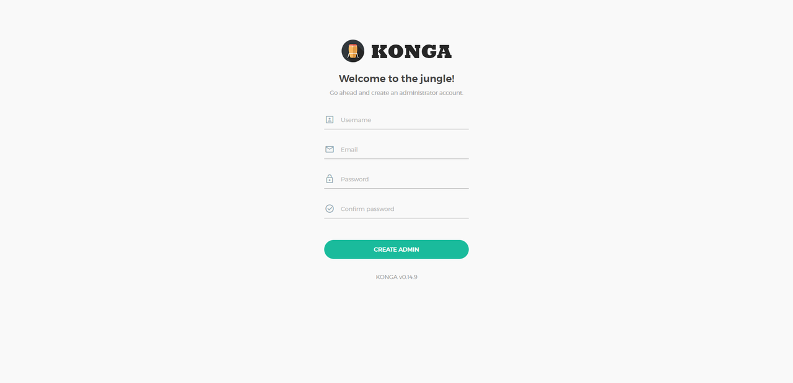

登录

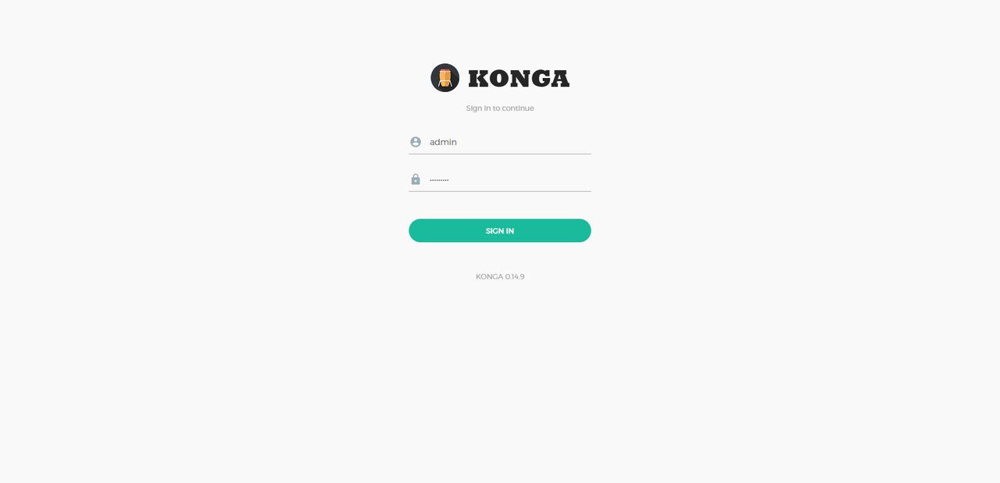

登录成功后，配置 kong 网关的管理地址

| 字段           | 值                   | 备注                                                                                                          |
| -------------- | -------------------- | ------------------------------------------------------------------------------------------------------------- |
| Name           | admin                | 自定义，注册用户时的管理员用户名                                                                              |
| Kong Admin URL | http://ddc-kong:8001 | ddc-kong 为 kong 网关容器名称 8001 为 kong 网关 admin_api 端口 konga 与 kong 之间通过 docker 内部虚拟网络通讯 |

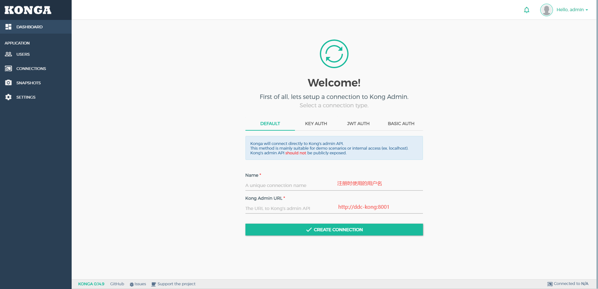

配置好即可连接到 kong 网关，管理配置网关。

因为之前有导入初始化网关配置，后续只需添加 upstream 配置和修改插件的配置，网关即可正常运行。

## <strong>PLUGINS 配置</strong>

<strong>access-key-auth-with-grpc</strong> 配置

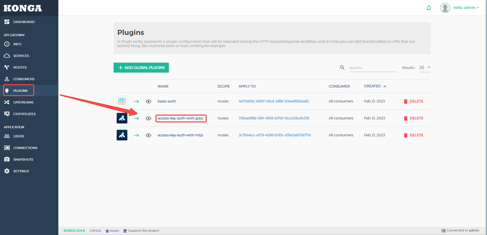

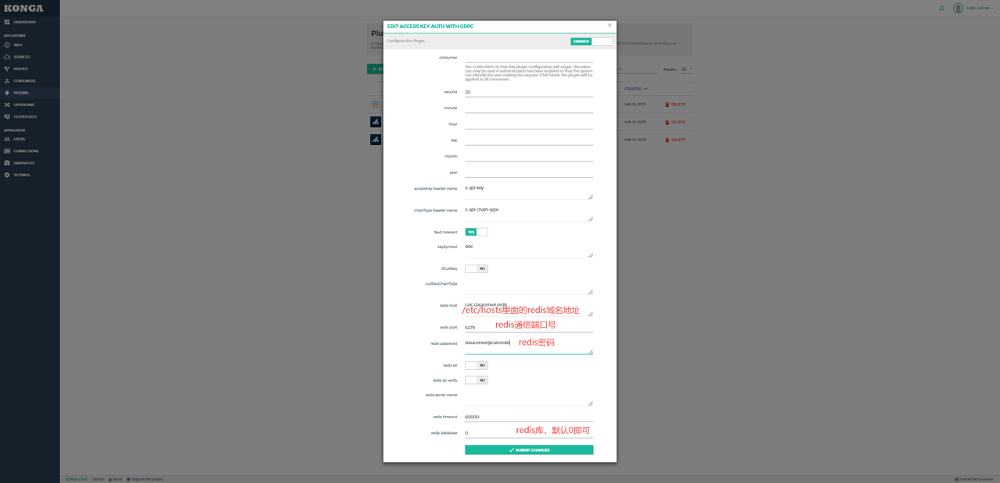

<strong>access-key-auth-with-</strong><strong>http</strong> 配置

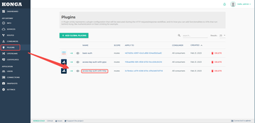

## <strong>Consumers 配置</strong>

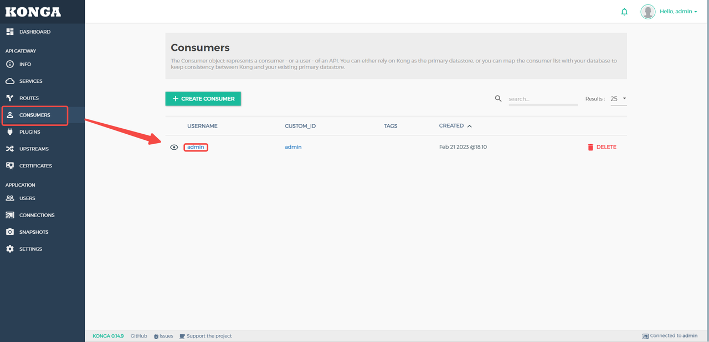

删除自动生成的 Basic Auth

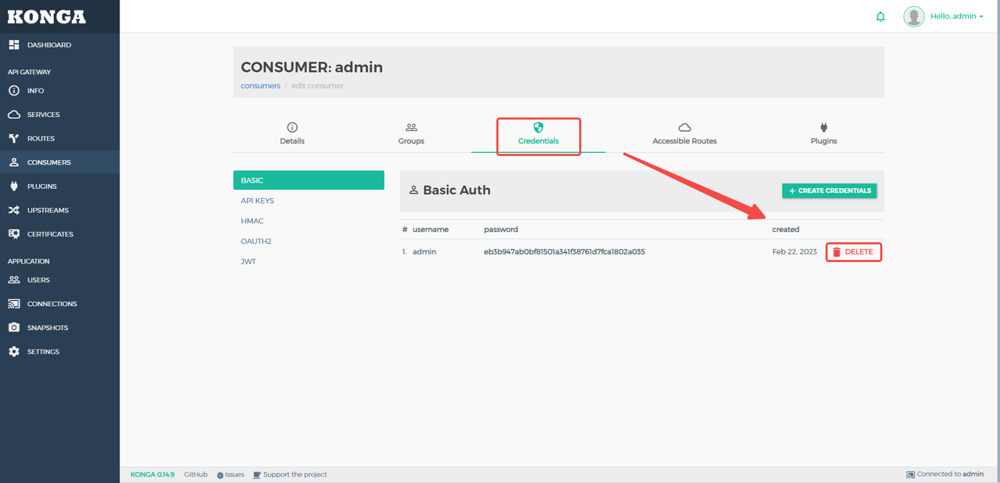

创建新的 Basic Auth

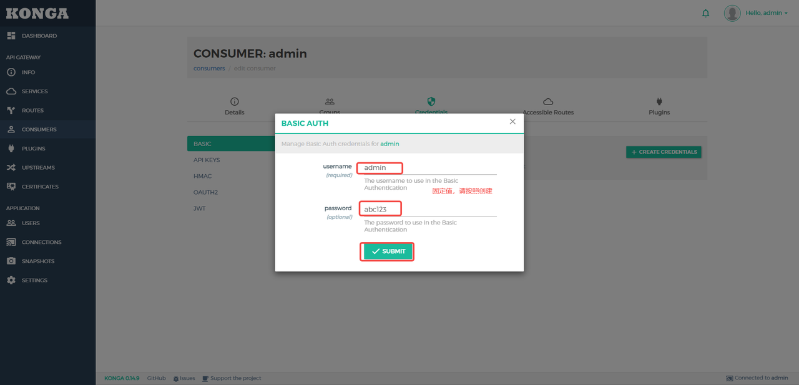

需要配置到算力中心 Nacos 的 kong-gateway-config.yml 里面

kong-gateway-config.yml 部分配置

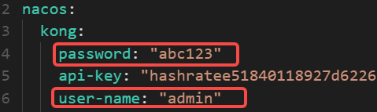

## <strong>upstream 配置</strong>

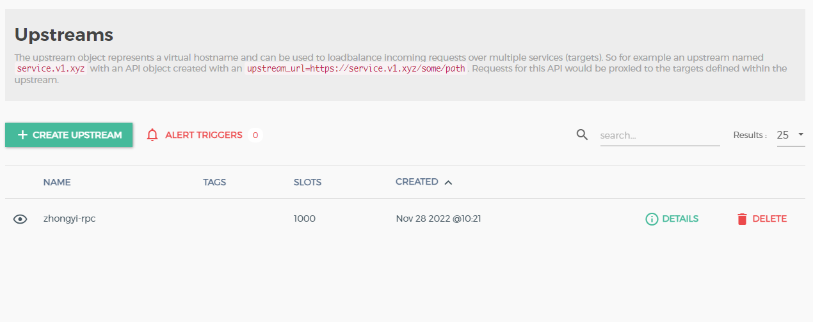

请按照如下表格配置<strong> upstreams</strong> 以及<strong> Targets</strong>

| <strong>Upstream Name</strong> | <strong>Targets</strong> | <strong>备注</strong>                                               |
| ------------------------------ | ------------------------ | ------------------------------------------------------------------- |
| eos-rest                       | 中移链节点 IP:3921       | 中移链 <strong>rest</strong> 接口                                   |
| eos-rpc                        | 中移链节点 IP:3921       | 中移链 <strong>rpc</strong> 接口                                    |
| irisnet-grpc                   | 文昌链节点 IP:9090       | 文昌链 <strong>grpc</strong> 接口                                   |
| irisnet-evmws                  | 文昌链节点 IP:8546       | 文昌链 <strong>evmws</strong> 接口                                  |
| irisnet-evmrpc                 | 文昌链节点 IP:8545       | 文昌链 <strong>evmrpc </strong>接口                                 |
| irisnet-ws                     | 文昌链节点 IP:26657      | 文昌链 <strong>ws</strong> 接口                                     |
| irisnet-rest                   | 文昌链节点 IP:1317       | 文昌链<strong> </strong><strong>rest</strong><strong> </strong>接口 |
| irisnet-rpc                    | 文昌链节点 IP:26657      | 文昌链 <strong>rpc</strong><strong> </strong>接口                   |
| fisco-rpc                      | 泰安链节点 IP:8545       | 泰安链 <strong>rpc</strong><strong> </strong>接口                   |
| eth-rpc                        | 武汉链节点 IP:20006      | 武汉链 <strong>rpc</strong><strong> </strong>接口                   |
| eth-ws                         | 武汉链节点 IP:8556       | 武汉链 <strong>ws </strong>接口                                     |

Upstream 配置

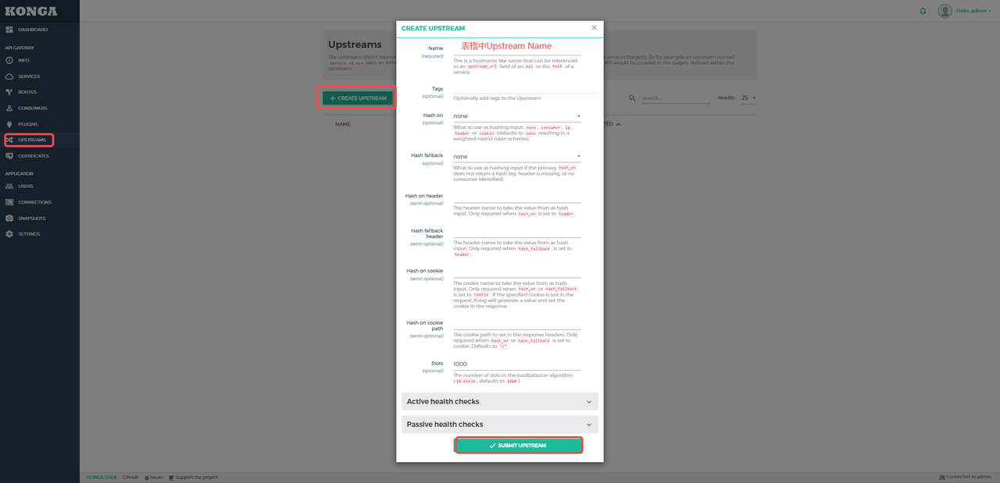

Targets 配置

<strong>targets 至少需要配置一个，这是最终接受交易的节点地址。</strong>

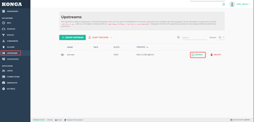

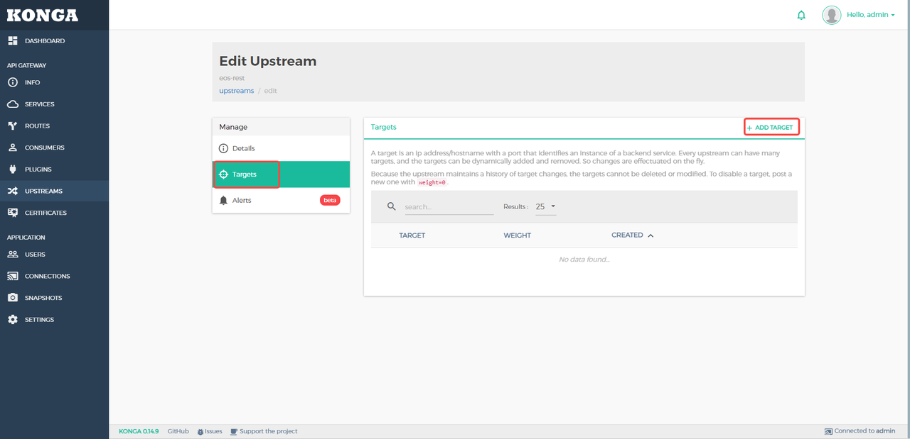

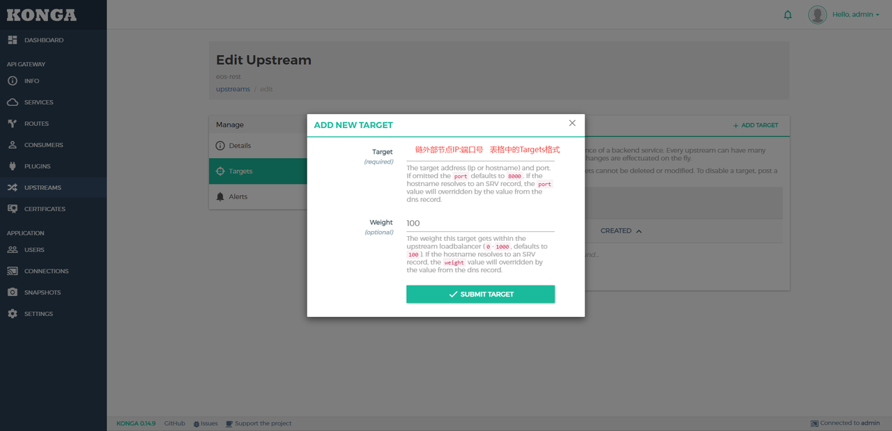

## 官方参考文档

kong 网关官方开发者文档地址：[https://docs.konghq.com/gateway/2.8.x/](https://docs.konghq.com/gateway/2.8.x/)

## <strong>网关</strong><strong>对外开放端口说明</strong>

18601：http/websocket 端口

18602：https/websockets 端口

18603：grpcs 端口

18605：grpc 端口

## <strong>网关</strong><strong>请求核心参数说明</strong>

用户接入 Key：accessKey

用户请求链接口类型：chainPort

#### 

## <strong>网关</strong><strong>请求格式</strong>

| <strong>备注</strong> | 请求方法 GET/POST | 请求格式                                                                       |
| --------------------- | ----------------- | ------------------------------------------------------------------------------ |
| 中移链 rpc 接口       |                   | http://[域名:端口]:18601/api/[用户接入 Key]/eos/rpc/                           |
| 文昌链 grpc 接口      |                   | [域名:端口]:18602                                                              |
| 文昌链 evmws 接口     |                   | ws://[域名:端口]:18602/api/[用户接入 Key]/irisnet/evmws/                       |
| 文昌链 evmrpc 接口    |                   | http://[域名:端口]:18601/api/[用户接入 Key]/irisnet/evmrpc/                    |
| 文昌链 ws 接口        |                   | ws://[域名:端口]:18602/api/[用户接入 Key]/irisnet/ws/                          |
| 文昌链 rest 接口      |                   | http://[域名:端口]:18601/api/[用户接入 Key]/irisnet/rest/                      |
| 文昌链 rpc 接口       |                   | [域名:端口]:18602 HEADER 配置： x-api-key:[用户接入 Key] x-api-chain-type:irisnet |
| 泰安链 rpc 接口       |                   | http://[域名:端口]:18601/api/[用户接入 Key]/fisco/rpc/                         |
|武汉链 rpc 接口||http://[域名:端口]:18601/api/[用户接入Key]/eth/rpc/
|武汉链 wc 接口||ws://[域名:端口]:18602/api/[用户接入Key]/eth/ws/
## <strong>验证步骤</strong>

在数据中心方门户中获取网关接入信息，然后按格式请求网关接口，验证请求是否可以成功。

注意<strong> [用户接入 Key]</strong> 的参数配置。

## Kong 网关验证

登录 <strong>BSN</strong><strong>城市</strong><strong>算力</strong><strong>中心运营系统</strong>

依次点击<strong>【网络接入】【</strong><strong>网关</strong><strong>管理】</strong>

根据部署的链节点勾选 <strong>接入方式 </strong>

依次点击网关配置信息的 <strong>【编辑】【保存】</strong>，页面上方出现修改成功字样证明与 kong 网关通讯正常

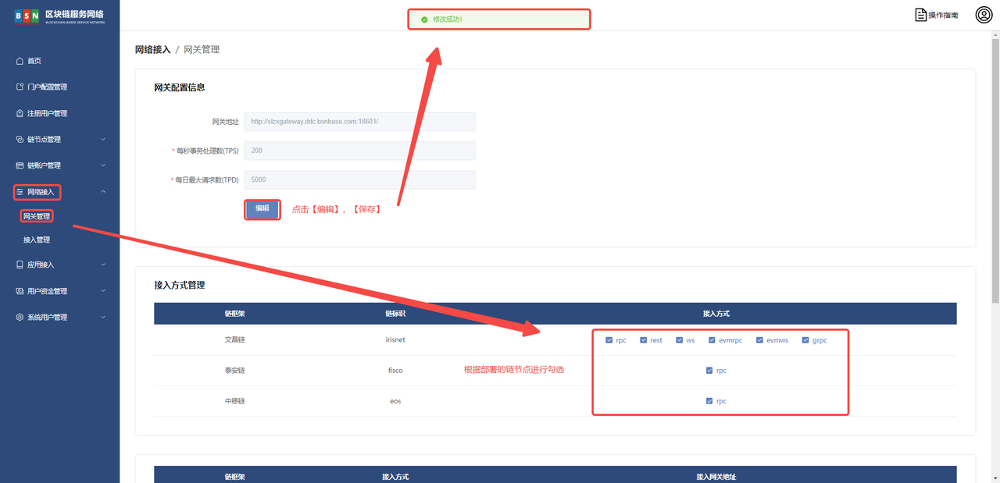
