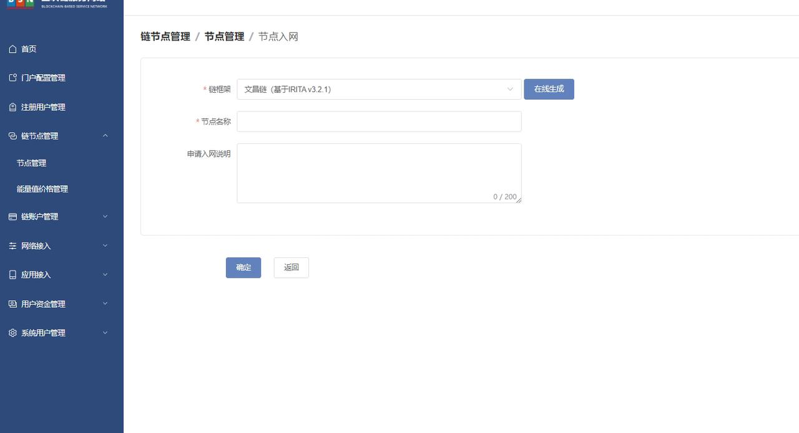

# 中移链节点入网部署文档

# 前言

# 一、版本信息

# 二、变更日志

| <strong>时间</strong> | <strong>版本号</strong> | <strong>变更人</strong> | <strong>主要变更内容</strong> |
| --------------------- | ----------------------- | ----------------------- | ----------------------------- |
| 2023-2-14             | V1.0                    | 周晓明                  | 编写文件大纲及示例            |
| 2023-2-14             | V1.1                    | 张云龙                  | 文档填充                      |

# 三、中移链节点入网

登录 <strong>BSN</strong><strong>城市</strong><strong>算力</strong><strong>中心运营系统 </strong>

依次点击【链节点管理】【节点管理】【节点入网】如下图




证书下载


压缩包内容


使用 txt 文档打开 <strong>node_cert.csr  </strong>将内容填入<strong> </strong><strong>CSR</strong><strong>文件内容 </strong> 栏目中

打开 txt 文档打开 <strong>node_public.pem</strong> 将内容填入 <strong>节点</strong><strong>公钥</strong> 栏目中

将 <strong>node_privare.pem</strong> 重命名为 <strong>server.key</strong> 参照 <strong>目录结构</strong> 放入指定文件夹中

点击 【确定】

审核通过后【<strong>链节点管理</strong>】【<strong>节点入网</strong>】<strong>节点列表 </strong>点击<strong>【确认入网】 </strong>填写 <strong>链外部节点</strong><strong>公网</strong><strong>IP</strong>

点击【<strong>链节点管理</strong>】【<strong>节点入网</strong>】<strong>节点列表 </strong>对应链名称的【<strong>查看</strong>】 <strong>下载证书</strong>

将证书文件按照目录结构放入指定文件夹

下载 docker-compose 启动文件

```bash
sudo wget -P /bsn/ https://data-center.s3.cn-northwest-1.amazonaws.com.cn/v2.2.1/deployPackageAndConfiguration/config-files/dockerAndShell/zhongyi-node.tar.gz
```

解压

```bash
sudo tar -xzvf /bsn/zhongyi-node.tar.gz -C /bsn/
```

下载配置文件

```bash
sudo wget -P /bsn/zhongyi-node/eos-node/node/ https://zhongyichain.s3.cn-northwest-1.amazonaws.com.cn/config/chain.js
sudo wget -P /bsn/zhongyi-node/eos-node/node/ https://zhongyichain.s3.cn-northwest-1.amazonaws.com.cn/config/config.json
sudo wget -P /bsn/zhongyi-node/eos-node/node/ https://zhongyichain.s3.cn-northwest-1.amazonaws.com.cn/config/genesis.json
```

下载历史数据

打开下面的链接地址，找到最新的数据快照地址，下载即可。

方式一：[blocks.log](http://69.230.241.203:8989/blockdata/blocks.log.zip) : [https://zhongyichain.s3.cn-northwest-1.amazonaws.com.cn/index.html#blockdata/](https://zhongyichain.s3.cn-northwest-1.amazonaws.com.cn/index.html#blockdata/)

方式二：[快照](http://69.230.241.203:8989/snapshot/snapshot-02a6f38d83104b589c59b242b98c946329d61266439f768d0a9668b26c6586a3.bin) : [https://zhongyichain.s3.cn-northwest-1.amazonaws.com.cn/index.html#snapshot/](https://zhongyichain.s3.cn-northwest-1.amazonaws.com.cn/index.html#snapshot/)

```bash
cd /bsn/zhongyi-node/
```

文件太大使用后台下载

```bash
nohup wget <最新日期的历史数据链接> &
```

查看当前目录下的 <strong>nohup.out</strong> 文件的下载过程

```bash
tail -f -n 10 nohup.out
```

输出以下内容为下载完成

```bash

```

- blocks.log：数据较大下载较慢，文件存放到 <strong>/bsn/zhongyi-node/eos-node/data/blocks/</strong>

下载的数据进行解压，按照 <strong>目录结构</strong> 放入指定文件夹

```bash
unzip blockslog-20xx-xx-xx.zip
```

- 快照方式：快照数据较小下载较快，文件存放到 <strong>/bsn/zhongyi-node/eos-node/data/snapshots/</strong>

<strong>快照方式需修改 chain.js 文件</strong>

下载的快照数据 <strong>目录结构</strong> 放入指 ls 定文件夹

chain.js 文件

在 chain_config 添加快照模块

```bash
const chain_config  = {"contracts-console": config.contracts_console,
    "hard-replay-blockchain": false,
    "abi-serializer-max-time-ms": "100",
    "chain-state-db-size-mb": "65536",
    "backing-store": "rocksdb",
    "snapshot": "/data/cmeos/snapshots/snapshot-2023-01-31.bin"
    };
```

注释以下行

```bash
//if (config.genesis_json) chain_config["genesis-json"] = path.join(__dirname, config.genesis_json);
```

## 目录结构

```bash
tree -L 4 /bsn/zhongyi-node
```

输出结果

```bash
├── docker-compose.yaml #启动文件
└── eos-node                
    ├── data
    │   ├── blocks          #初始化文件和快照文件二选一
    │   │   └── blocks.log  
    │   ├── snapshots       # 快照文件和初始化文件二选一
    │       └── snapshot-029d36edf7574a7572a81ca0a209342059caa1077b8dd8789860f4e6cce9f2b5.bin 
    └── node
        ├── ca.crt          
        ├── chain.js        #节点配置文件
        ├── config.json     #节点p2p配置文件
        ├── genesis.json    #创世块文件
        ├── server.crt
        └── server.key      #将node_private.pem改名成server.key
```

启动中移链节点

```bash
cd /bsn/zhongyi-node
```

```bash
docker compose up -d
```

端口说明：

- p2p 端口：3922
- rpc 端口：3921
- rest 端口：3921

日志查看

```bash
docker logs -f zhongyi-node --tail 50
```

输出结果


未开放白名单

<strong>查询块高</strong>

官方 api 参考链接：[https://developers.eos.io/manuals/eos/latest/nodeos/plugins/chain_api_plugin/api-reference/index](https://developers.eos.io/manuals/eos/latest/nodeos/plugins/chain_api_plugin/api-reference/index)

```bash
curl http://127.0.0.1:3921/v1/chain/get_info
```

查看公网 IP，将公网 IP 填入运营系统确认入网
