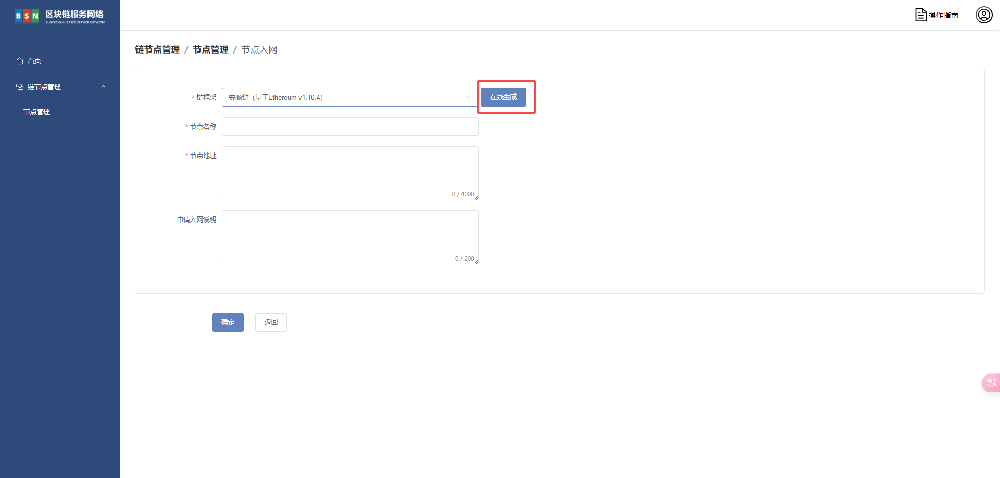
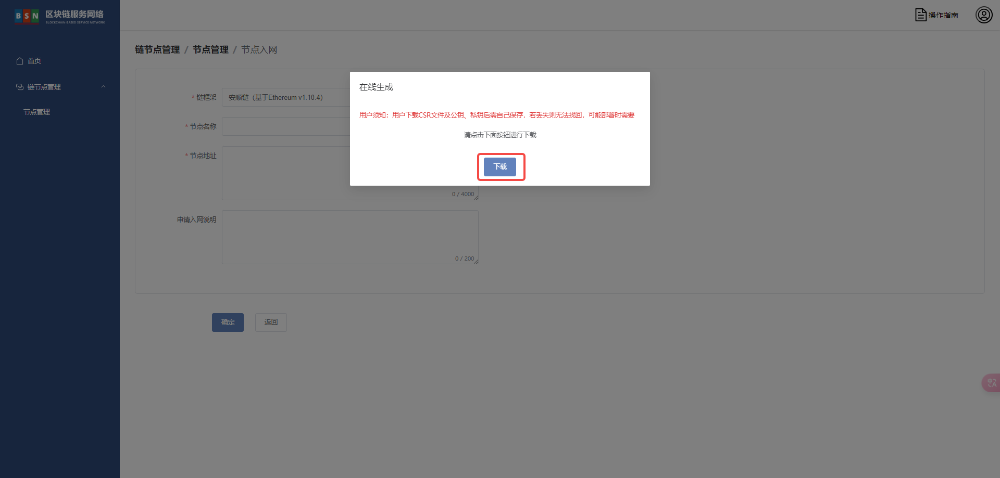
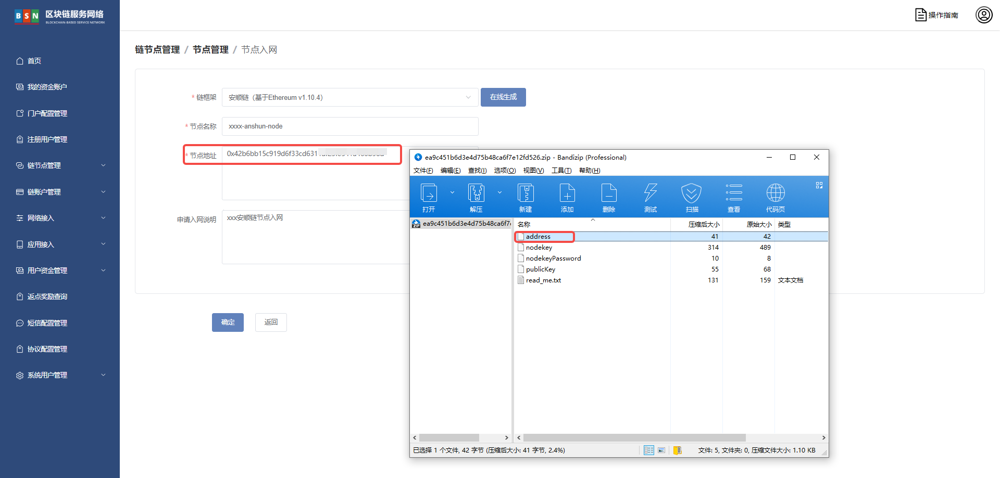

# 安顺链节点入网部署文档

# 前言

# 一、版本信息

# 二、变更日志

| <strong>时间</strong> | <strong>版本号</strong> | <strong>变更人</strong> | <strong>主要变更内容</strong> |
| --------------------- | ----------------------- | ----------------------- | ----------------------------- |
| 2023-12-25            | V1.0                    | 张云龙                  | 编写文件大纲及文档填充        |

# 三、安顺链节点入网

登录 <strong>BSN</strong><strong>城市</strong><strong>算力</strong><strong>中心运营系统 </strong>

依次点击【链节点管理】【节点管理】【节点入网】如下图








点击 【确定】

审核通过后填写 <strong>链外部节点</strong><strong>公网</strong><strong>IP</strong>

<strong>链外部节点启动文件以及历史数据准备</strong>

下载 docker-compose 启动文件到 <strong>安顺链外部节点 </strong>服务器

```bash
sudo wget -P /bsn/ https://data-center.s3.cn-northwest-1.amazonaws.com.cn/v2.2.1/deployPackageAndConfiguration/config-files/dockerAndShell/anshun-node.tar.gz
```

解压

```bash
sudo tar -xzvf /bsn/anshun-node.tar.gz -C /bsn/
```

将<strong>算力中心运营平台</strong>在线生成的文件 <strong>address nodekeyPassword </strong>上传至/bsn/anshun-node/node/目录下

目录结构如下

```bash
[root@AWS-NGX01-A161 node]# tree /bsn/anshun-node/
/bsn/anshun-node/
├── docker-compose.yaml
└── node
    ├── address
    ├── nodekeyPassword
    └── start.sh
```

下载创世块文件

```bash
wget https://anshunchain.s3.cn-northwest-1.amazonaws.com.cn/config/genesis.json -P /bsn/anshun-node/node/
```

初始化节点数据

```bash
docker run -i --rm -v /bsn/anshun-node/node:/root bsnddc/anshunchain:v1.7.0 geth --datadir /root/ init /root/genesis.json
docker run -i --rm -v /bsn/anshun-node/node:/root bsnddc/anshunchain:v1.7.0 geth genesisTool generate --basePath /root --nodeCount 4 --nodePass "$(cat /bsn/anshun-node/node/nodekeyPassword)"
```

初始化后的目录结构

```bash
[root@AWS-NGX01-A161 node]# tree /bsn/anshun-node/
/bsn/anshun-node/
├── docker-compose.yaml
└── node
    ├── address
    ├── genesis.json
    ├── geth
    │   ├── chaindata
    │   │   ├── 000001.log
    │   │   ├── CURRENT
    │   │   ├── LOCK
    │   │   ├── LOG
    │   │   └── MANIFEST-000000
    │   ├── lightchaindata
    │   │   ├── 000001.log
    │   │   ├── CURRENT
    │   │   ├── LOCK
    │   │   ├── LOG
    │   │   └── MANIFEST-000000
    │   ├── LOCK
    │   └── nodekey
    ├── keystore
    ├── nodekeyPassword
    └── start.sh
```

上传 nodekey 到 <strong>/bsn/anshun-node/node/geth/</strong> 下进行覆盖

复制<strong>/bsn/anshun-node/node/genesis.json</strong>创世块文件到<strong>/bsn/anshun-node/node/geth/</strong>目录下

```bash
cp -a /bsn/anshun-node/node/genesis.json /bsn/anshun-node/node/geth/
```

下载<strong>static-nodes.json</strong>到<strong>/bsn/anshun-node/node/geth/</strong>目录下

```bash
wget https://anshunchain.s3.cn-northwest-1.amazonaws.com.cn/config/static-nodes.json -P /bsn/anshun-node/node/geth/
```

启动节点

```bash
cd /bsn/anshun-node/
docker compose up -d # 或者 docker-compose up -d
```

日志输出

```bash
[root@AWS-NGX01-A161 anshun-node]# docker logs -f anshun-node 
INFO [12-25|12:55:29.636] Maximum peer count                       ETH=100 LES=0 total=100
INFO [12-25|12:55:29.636] Smartcard socket not found, disabling    err="stat /run/pcscd/pcscd.comm: no such file or directory"
DEBUG[12-25|12:55:29.640] FS scan times                            list="219.603µs" set="1.42µs" diff="3.61µs"
DEBUG[12-25|12:55:29.641] FS scan times                            list="30.319µs"  set=550ns    diff=861ns
WARN [12-25|12:55:29.641] Using deprecated resource file /opt/geth/nodekey, please move this file to the 'geth' subdirectory of datadir. 
TRACE[12-25|12:55:29.640] Started watching keystore folder         path=/opt/geth/keystore
WARN [12-25|12:55:29.826] Found deprecated node list file /opt/geth/static-nodes.json, please use the TOML config file instead. 
DEBUG[12-25|12:55:29.828] Sanitizing Go's GC trigger               percent=100
INFO [12-25|12:55:29.828] Set global gas cap                       cap=40,000,000
INFO [12-25|12:55:29.828] Allocated trie memory caches             clean=154.00MiB dirty=256.00MiB
INFO [12-25|12:55:29.828] Allocated cache and file handles         database=/opt/geth/chaindata cache=512.00MiB handles=32768
DEBUG[12-25|12:55:29.854] Chain freezer table opened               database=/opt/geth/chaindata/ancient table=headers items=0 size=0.00B
DEBUG[12-25|12:55:29.854] Chain freezer table opened               database=/opt/geth/chaindata/ancient table=hashes  items=0 size=0.00B
DEBUG[12-25|12:55:29.854] Chain freezer table opened               database=/opt/geth/chaindata/ancient table=bodies  items=0 size=0.00B
DEBUG[12-25|12:55:29.854] Chain freezer table opened               database=/opt/geth/chaindata/ancient table=receipts items=0 size=0.00B
DEBUG[12-25|12:55:29.854] Chain freezer table opened               database=/opt/geth/chaindata/ancient table=diffs    items=0 size=0.00B
INFO [12-25|12:55:29.854] Opened ancient database                  database=/opt/geth/chaindata/ancient readonly=false
INFO [12-25|12:55:29.855] Initialised chain configuration          config="{ChainID: 10898 Homestead: 0 DAO: <nil> DAOSupport: false EIP150: 0 EIP155: 0 EIP158: 0 Byzantium: 0 Constantinople: 0 Petersburg: 0 Istanbul: 0, Muir Glacier: <nil>, Berlin: <nil>, London: <nil>, Engine: unknown}"
DEBUG[12-25|12:55:29.860] Current full block not old enough        number=0 hash=9b9307..788fdf delay=90000
INFO [12-25|12:55:30.013] [epoch]                                  load current epoch="{StartHeight: 0, LastStartHeight: 0, Valset: [0x90ea405942ae0F6F64769fB44FAD69BBA15e33A4 0x91d793ABb2d0473B2EE709172646f5810ee1f2EC 0xFA8bA41dE78a83F8E9ff08c9bFBc542c2bfe6035 0xf6A215e25c7bE26d1dC0CfbDFc922bfF556208f2], Size: 4}"
INFO [12-25|12:55:30.013] [epoch]                                  read epoch="{StartHeight: 0, LastStartHeight: 0, Valset: [0x90ea405942ae0F6F64769fB44FAD69BBA15e33A4 0x91d793ABb2d0473B2EE709172646f5810ee1f2EC 0xFA8bA41dE78a83F8E9ff08c9bFBc542c2bfe6035 0xf6A215e25c7bE26d1dC0CfbDFc922bfF556208f2], Size: 4}"
INFO [12-25|12:55:30.013] Initialising Ethereum protocol           network=10898 dbversion=8
INFO [12-25|12:55:30.023] Loaded most recent local header          number=0 hash=9b9307..788fdf td=1 age=54y9mo6d
INFO [12-25|12:55:30.023] Loaded most recent local full block      number=0 hash=9b9307..788fdf td=1 age=54y9mo6d
INFO [12-25|12:55:30.023] Loaded most recent local fast block      number=0 hash=9b9307..788fdf td=1 age=54y9mo6d
DEBUG[12-25|12:55:30.024] Loaded snapshot journal                  diskroot=db9f75..dbee56 diffhead=db9f75..dbee56
DEBUG[12-25|12:55:30.024] Reinjecting stale transactions           count=0
INFO [12-25|12:55:30.026] Loaded local transaction journal         transactions=0 dropped=0
INFO [12-25|12:55:30.026] Regenerated local transaction journal    transactions=0 accounts=0
DEBUG[12-25|12:55:30.027] Recalculated downloader QoS values       rtt=20s confidence=1.000 ttl=1m0s
INFO [12-25|12:55:30.027] Gasprice oracle is ignoring threshold set threshold=2
INFO [12-25|12:55:30.027] Starting peer-to-peer node               instance=Geth/geth/v1.10.4-stable/linux-amd64/go1.18.10
TRACE[12-25|12:55:30.046] Adding static node                       id=5645da097e53da59 ip=52.83.251.21 added=true
TRACE[12-25|12:55:30.046] Starting p2p dial                        id=5645da097e53da59 ip=52.83.251.21 flag=staticdial
DEBUG[12-25|12:55:30.046] TCP listener up                          addr=[::]:30300
INFO [12-25|12:55:30.048] New local node record                    seq=2 id=0f4ba22a60ceaa2a ip=127.0.0.1    udp=0 tcp=30300
INFO [12-25|12:55:30.048] Started P2P networking                   self="enode://8d3c34d9a6c39c72797377aced7f852884e7690efe5c416059420fa16d8ee79f17b506c44e1b1ec2ea8ebd9be022038db6d4990a8adee004b215736496006809@127.0.0.1:30300?discport=0"
DEBUG[12-25|12:55:30.049] IPCs registered                          namespaces=admin,debug,web3,eth,txpool,personal,istanbul,miner,net
INFO [12-25|12:55:30.049] IPC endpoint opened                      url=/opt/geth/geth.ipc
DEBUG[12-25|12:55:30.050] Allowed origin(s) for WS RPC interface [*] 
INFO [12-25|12:55:30.050] HTTP server started                      endpoint=[::]:8545 prefix= cors=* vhosts=*
INFO [12-25|12:55:30.050] WebSocket enabled                        url=ws://[::]:8546
DEBUG[12-25|12:55:32.147] Couldn't add port mapping                proto=tcp extport=30300 intport=30300 interface="UPnP or NAT-PMP" err="no UPnP or NAT-PMP router discovered"
TRACE[12-25|12:55:45.047] Dial error                               id=5645da097e53da59 addr=52.83.251.21:30304 conn=staticdial err="i/o timeout"
INFO [12-25|12:55:45.047] Looking for peers                        peercount=0 tried=1 static=1
DEBUG[12-25|12:55:50.027] Recalculated downloader QoS values       rtt=20s confidence=1.000 ttl=1m0s
TRACE[12-25|12:56:05.048] Starting p2p dial                        id=5645da097e53da59 ip=52.83.251.21 flag=staticdial
INFO [12-25|12:56:05.048] Looking for peers                        peercount=0 tried=0 static=1
DEBUG[12-25|12:56:10.028] Recalculated downloader QoS values       rtt=20s confidence=1.000 ttl=1m0s
TRACE[12-25|12:56:20.049] Dial error                               id=5645da097e53da59 addr=52.83.251.21:30304 conn=staticdial err="i/o timeout"
INFO [12-25|12:56:20.049] Looking for peers                        peercount=0 tried=1 static=1
```

<strong>端口说明</strong>

- p2p 端口：30300
- json rpc：8545
- Ws port: 8546

块高查询

```bash
curl -X POST --header 'Content-Type: application/json' --data '{"jsonrpc": "2.0","method": "eth_blockNumber","params": [],"id": 83}' http://127.0.0.1:8545
```
