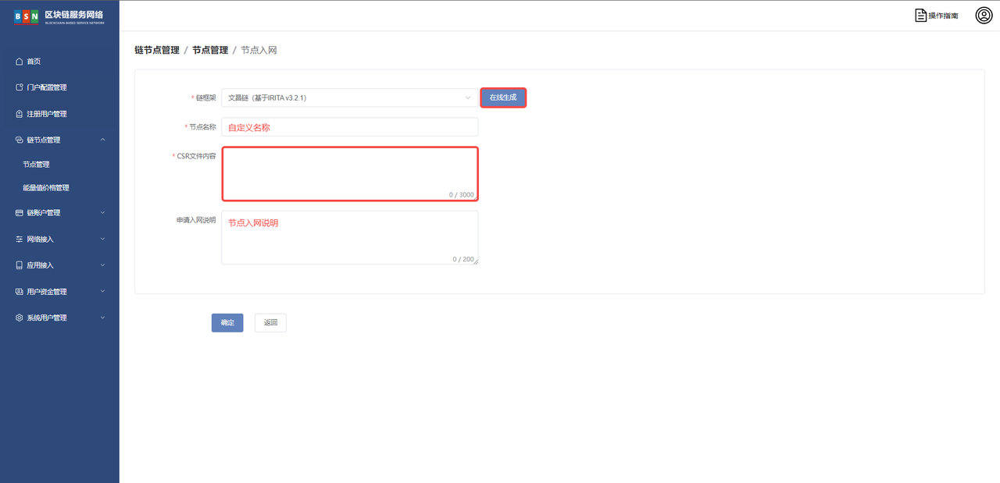
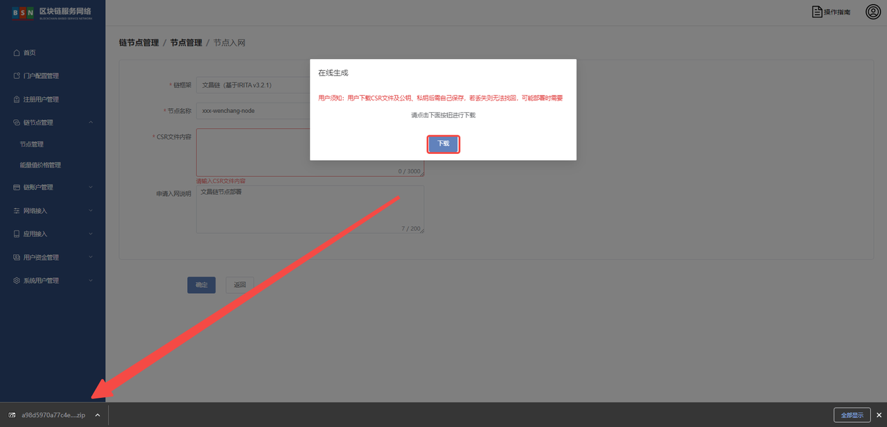
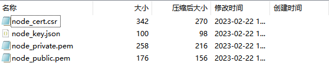
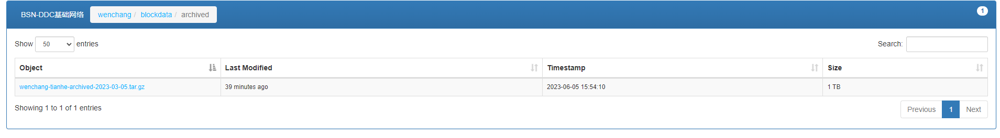
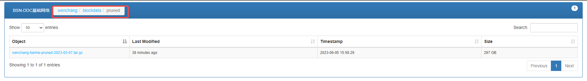

# 文昌链节点入网部署文档

# 前言

# 一、版本信息

# 二、变更日志

| <strong>时间</strong> | <strong>版本号</strong> | <strong>变更人</strong> | <strong>主要变更内容</strong> |
| --------------------- | ----------------------- | ----------------------- | ----------------------------- |
| 2023-2-14             | V1.0                    | 周晓明                  | 编写文件大纲及示例            |
| 2023-2-14             | V1.1                    | 张云龙                  | 文档填充                      |

# 三、文昌链节点入网

登录 <strong>BSN</strong><strong>城市</strong><strong>算力</strong><strong>中心运营系统 </strong>

依次点击【链节点管理】【节点管理】【节点入网】如下图


文昌链节点入网





压缩包内容



将下载的压缩包解压后 <strong>node_cert.csr</strong> 文件内容  填入 <strong>CSR</strong><strong>文件内容</strong> 栏目中

点击 【确定】

审核通过后【<strong>链节点管理</strong>】【<strong>节点入网</strong>】<strong>节点列表 </strong>点击<strong>【确认入网】 </strong>填写 <strong>链外部节点</strong><strong>公网</strong><strong>IP</strong>

点击【<strong>链节点管理</strong>】【<strong>节点入网</strong>】<strong>节点列表</strong>对应链名称的【<strong>查看</strong>】 <strong>下载证书</strong>

将证书文件按照目录结构放入指定文件夹

下载 docker-compose 启动文件

```bash
sudo wget -P /bsn/ https://data-center.s3.cn-northwest-1.amazonaws.com.cn/v2.2.1/deployPackageAndConfiguration/config-files/dockerAndShell/wenchang-node.tar.gz
```

解压

```shell
tar -zxvf wenchang-node.tar.gz
```

查看 docker-compose 文件

```bash
cat /bsn/wenchang-node/docker-compose.yml
```

输出结果

```bash

```

下载配置文件

```bash
wget -P /bsn/wenchang-node/node/.irita/ https://wenchangchain.s3.cn-northwest-1.amazonaws.com.cn/config/config.tar.gz
```

解压

```bash
sudo tar -xzvf  /bsn/wenchang-node/node/.irita/config.tar.gz -C /bsn/wenchang-node/node/.irita/
```

意外报错

```shell
[root@iZbp1dsfi1dvru44scsjctZ bsn]# sudo tar -xzvf  /bsn/wenchang-node/node/.irita/config.tar.gz -C /bsn/wenchang-node/node/.irita/

gzip: stdin: not in gzip format
tar: Child returned status 1
tar: Error is not recoverable: exiting now
```

如果出现报错执行次命令

```shell
sudo tar -xvf /bsn/wenchang-node/node/.irita/config.tar.gz -C /bsn/wenchang-node/node/.irita/
```

```shell
[root@iZbp1dsfi1dvru44scsjctZ bsn]# sudo tar -xvf /bsn/wenchang-node/node/.irita/config/config.tar.gz -C /bsn/wenchang-node/node/.irita/config/
config/
config/genesis.json
config/client.toml
config/config.toml
config/app.toml
[root@iZbp1dsfi1dvru44scsjctZ bsn]#
```

目录结构

```bash
tree -al /bsn/wenchang-node/
```

输出结果

```bash
/bsn/wenchang-node/
├── docker-compose.yml
└── node
    └── .irita
        ├── config
        │   ├── app.toml
        │   ├── client.toml
        │   ├── config.toml
        │   └── genesis.json
        │   └── node_key.json
        │── config.tar.gz
        └── data
```

下载历史数据

全量数据快照下载地址：[https://wenchang.s3.cn-northwest-1.amazonaws.com.cn/index.html#blockdata/archived/](https://wenchang.s3.cn-northwest-1.amazonaws.com.cn/index.html#blockdata/archived/)



裁剪快照下载地址:[https://wenchang.s3.cn-northwest-1.amazonaws.com.cn/index.html#blockdata/pruned/](https://wenchang.s3.cn-northwest-1.amazonaws.com.cn/index.html#blockdata/pruned/)



示例为 <strong>裁剪快照</strong> 启动

```bash
cd /bsn/wenchang-node
```

```bash
nohup wget <最新日期下载链接> &
```

下载过程请查看当前目录下的 <strong>nohup.out </strong>文件

```bash
tail -f -n 10 nohup.out
```

输出结果

```bash

```

下载完成之后解压（具体目录需要验证）

```bash
tar -xzvf 2023-xx-xx.tar.gz -C<strong> </strong><strong>/bsn/wenchang-node/node/.irita</strong>
```

启动节点

```bash
cd /bsn/wenchang-node
```

```bash
sudo docker compose up -d
```

<strong>日志查看</strong>

```bash
docker logs -f  wenchang-node --tail 50
```

<strong>端口说明</strong>

- rpc: 26657
- ws: 26657
- p2p: 26656
- rest: 1317
- evmrpc: 8545
- evmws: 8546
- grpc: 9090
- prometheus_metrics: 26660(可选，由客户自己决定)

<strong>查询</strong>

查询当前块高

```bash
curl http://127.0.0.1:26657/abci_info
```

查询节点状态

```bash
curl http://127.0.0.1:26657/status
```

如果能查询到当前块高和节点状态，则节点部署完成。

查看公网 IP，将公网 IP 填入运营系统确认入网

登陆文昌链节点

```shell
docker exec -ti  【container_name】 bash
```

查看是否有新入网节点 ID

```shell
irita q node nodes |grep -i '6700f9a9c776cfaecf462f4be34981e85d47ad3f'
```
