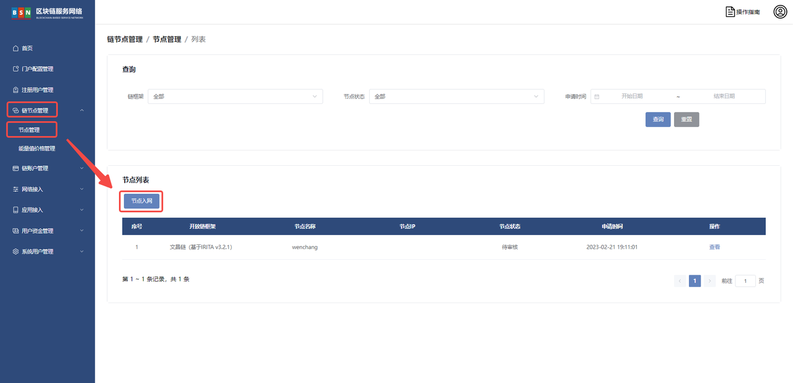
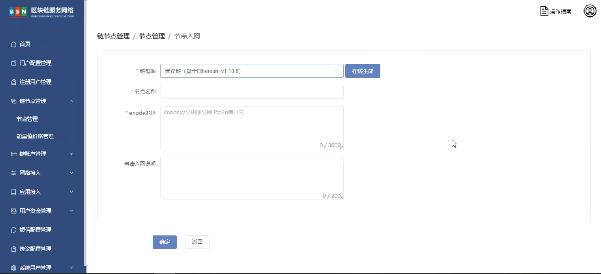
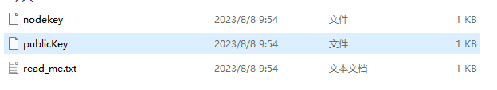

# 武汉链节点入网部署文档

# 前言

# 一、版本信息

# 二、变更日志

| <strong>时间</strong> | <strong>版本号</strong> | <strong>变更人</strong> | <strong>主要变更内容</strong> |
| --------------------- | ----------------------- | ----------------------- | ----------------------------- |
| 2023-2-14             | V1.0                    | 周晓明                  | 编写文件大纲及示例            |
| 2023-6-20             | V1.2                    | 张云龙                  | 文档填充                      |

# 三、武汉链节点入网

登录 <strong>BSN</strong><strong>城市</strong><strong>算力</strong><strong>中心运营系统 </strong>

依次点击【链节点管理】【节点管理】【节点入网】如下图



将 publicKey 填写至节点公钥，点击确定进行审核

<strong>链外部节点启动文件以及历史数据准备</strong>

下载 docker-compose 启动文件到 <strong>武汉链外部节点 </strong>服务器

```bash
sudo wget -P /bsn/ https://data-center.s3.cn-northwest-1.amazonaws.com.cn/startup-files/docker/wuhan-node.tar.gz
```

解压

```bash
sudo tar -xzvf /bsn/wuhan-node.tar.gz -C /bsn/
```

下载配置文件

创世块文件 genesis.json 下载至<strong>/bsn/wuhan-node/</strong>

```bash
sudo wget -P /bsn/wuhan-node/ https://wuhanchain.s3.cn-northwest-1.amazonaws.com.cn/config/genesis.json
```

启动脚本 start.sh 下载至<strong>/bsn/wuhan-node/</strong>

```bash
sudo wget -P /bsn/wuhan-node/ https://wuhanchain.s3.cn-northwest-1.amazonaws.com.cn/config/start.sh
chmod +x /bsn/wuhan-node/start.sh
```

点击【在线生成】，生成的文件包含 nodekey 和 publicKey

enode://<strong>节点公钥</strong>@<strong>公网 IP</strong>:<strong>P2P</strong><strong>端口号   填入图中的 enode 地址中</strong>



static-nodes.json 文件下载至 <strong>/bsn/wuhan-node/geth/ </strong>并修改按照格式将本机的公钥添加至文件中

```bash
sudo wget -P /bsn/wuhan-node/geth/ https://wuhanchain.s3.cn-northwest-1.amazonaws.com.cn/config/static-nodes.json
```

节点公钥内容从算力中心运营平台下载后的 publicKey 文件获取



将  "enode://<strong>节点公钥</strong>@<strong>公网 IP</strong>:<strong>P2P</strong><strong>端口号</strong>?discport=0"  填入 static-nodes.json 中

如下/bsn/wuhan-node/static-nodes.json

```bash
[
"enode://e9f994c0fea5358f6f9c821b5a8d3712135113ed793ec428adc9dbc27abfce62eb7760909b173c2311105aaa79e7047d7ea3c225780039662bcd340a9094e792@wuhansentry1.bsnbase.com:30006?discport=0",
"enode://e9438bce05977eea1ebb74fbb9bb1475627ec1aec333eb79882f58d83a105886f8ddbc4b302a7f06e126321e87a714f96f9da2e4a55b1598bdd02906c0b3f2ca@wuhansentry2.bsnbase.com:30007?discport=0"
"enode://e5e6fac793ff49cf61b2f75091733fc26e26853159498199d416c85807c4d8fa78272d71ebd20e701785d53f125f1c059f504c0a63b006c163ed3c8548ea7977@69.231.188.231:30006?discport=0"
]
```

拷贝 static-nodes.json 到 /bsn/wuhan-node/geth/trusted-nodes.json

```bash
cp -a /bsn/wuhan-node/geth/static-nodes.json /bsn/wuhan-node/geth/trusted-nodes.json
```

将运营管理系统下载的 nodekey 放至 <strong>/bsn/wuhan-node/geth/ </strong>

下载历史数据（后台下载）

```bash
cd /bsn/wuhan-node/
nohup wget https://wuhanchain.s3.cn-northwest-1.amazonaws.com.cn/data/data.zip &
```

查看当前目录 nohup.out 文件可看到下载进度

```bash
tail -f -n 10 nohup.out
```

输出以下内容为下载完成

```
19844750K .......... .......... .......... .......... .......... 99%  120M 0s
19844800K .......... .......... .......... .......... .......... 99% 15.0M 0s
19844850K .......... .......... .......... .......... .......... 99% 13.5M 0s
19844900K .......... .......... .......... .......... .......... 99% 55.9M 0s
19844950K .......... .......... .......... .......... .......... 99% 95.6M 0s
19845000K .......... .......... .......... .......... .......... 99% 13.4M 0s
19845050K .......... .......... .......... .......... ......    100%  155M=7m25s
```

解压后数据自动放置<strong>/bsn/wuhan-node/geth</strong>下

```bash
unzip data.zip
```

目录结构

```bash
tree -L 3 /bsn/wuhan-node
```

目录文件结构如下

```bash
/bsn/wuhan-node
├── data.zip
├── docker-compose.yml
├── genesis.json
├── geth
│   ├── chaindata
│   ├── lightchaindata
│   ├── LOCK
│   ├── nodekey
│   ├── nodes
│   ├── static-nodes.json
│   ├── transactions.rlp
│   ├── triecache
│   └── trusted-nodes.json
└── start.sh
```

端口说明

p2p 端口：30006

http.port：20006

ws.port：8556

启动节点

```bash
docker-compose up -d
```

日志查看

```bash
docker logs -f eth
```

查询块高

```bash
curl --location '127.0.0.1:20006' --header 'Content-Type: application/json' --data '{"jsonrpc": "2.0","method": "eth_blockNumber","params": [],"id": 83}'
```
