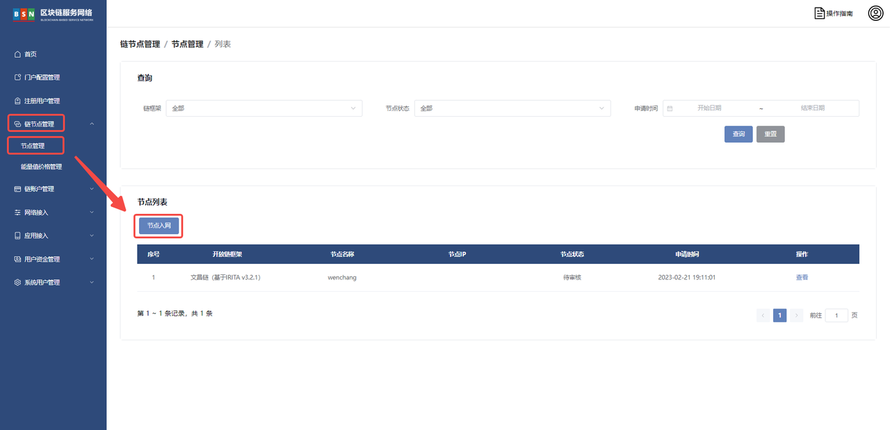
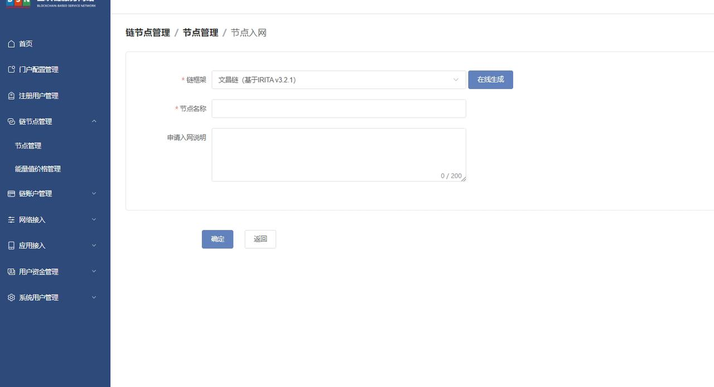
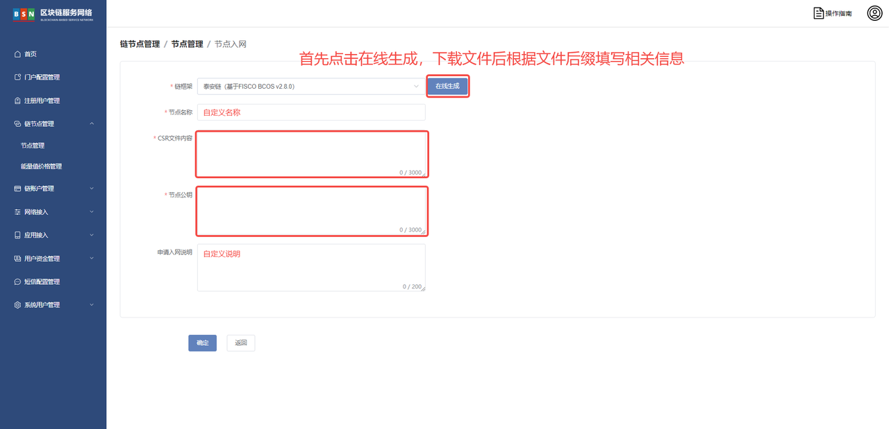
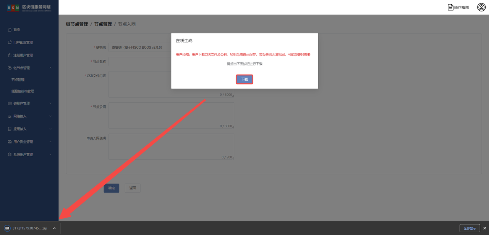
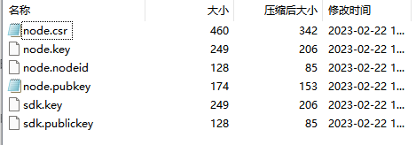
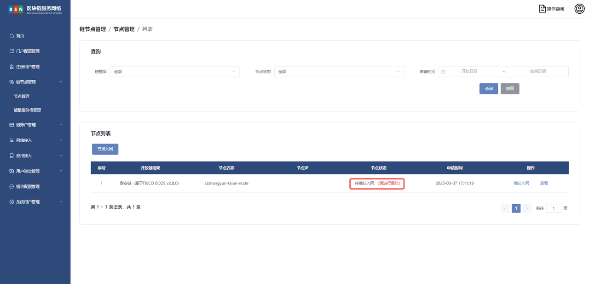
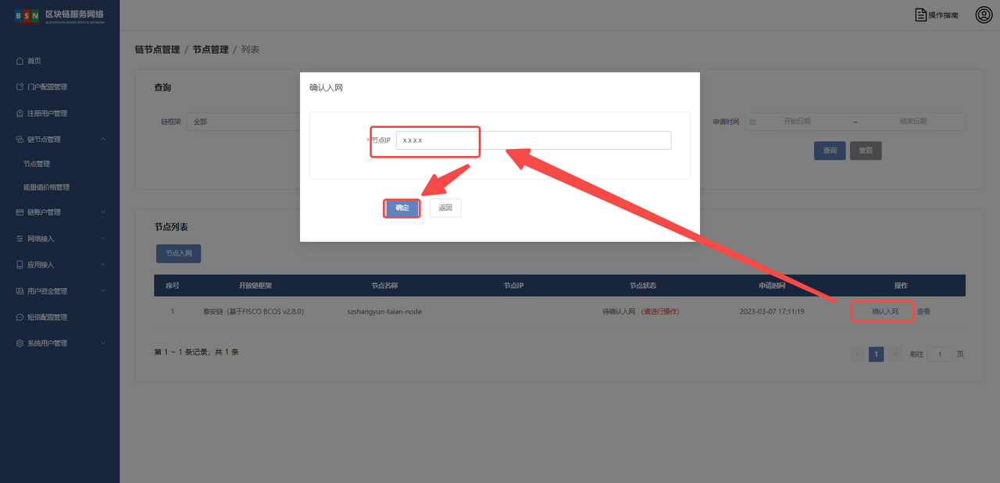
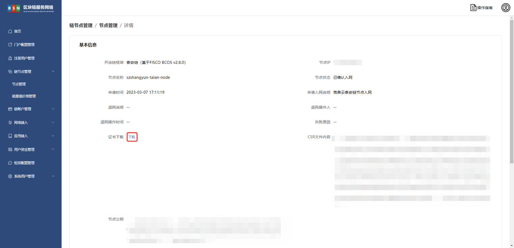

# 泰安链节点入网部署文档

# 前言

# 一、版本信息

# 二、变更日志

| <strong>时间</strong> | <strong>版本号</strong> | <strong>变更人</strong> | <strong>主要变更内容</strong> |
| --------------------- | ----------------------- | ----------------------- | ----------------------------- |
| 2023-2-14             | V1.0                    | 周晓明                  | 编写文件大纲及示例            |
| 2023-2-14             | V1.1                    | 张云龙                  | 文档填充                      |

# 三、泰安链节点入网

登录 <strong>BSN</strong><strong>城市</strong><strong>算力</strong><strong>中心运营系统 </strong>

依次点击【链节点管理】【节点管理】【节点入网】如下图





证书下载





压缩包内容



使用 txt 文档打开 <strong>node.csr  </strong>将内容填入<strong> </strong><strong>CSR</strong><strong>文件内容 </strong> 栏目中

打开 txt 文档打开 <strong>node.pubkey</strong> 将内容填入 <strong>节点</strong><strong>公钥</strong> 栏目中

点击 【确定】



审核通过后填写 <strong>链外部节点</strong><strong>公网</strong><strong>IP</strong>



点击【查看】 <strong>下载证书</strong>



将证书文件按照目录结构放入指定文件夹

<strong>链外部节点启动文件以及历史数据准备</strong>

下载 docker-compose 启动文件到 <strong>泰安链外部节点 </strong>服务器

```bash
sudo wget -P /bsn/ https://data-center.s3.cn-northwest-1.amazonaws.com.cn/v2.2.1/deployPackageAndConfiguration/config-files/dockerAndShell/taian-node.tar.gz
```

解压

```bash
sudo tar -xzvf /bsn/taian-node.tar.gz -C /bsn/
```

下载配置文件

配置文件包括 config.ini, group.1.genesis, group.1.ini, 页面下载地址为：

[https://taianchain.s3.cn-northwest-1.amazonaws.com.cn/index.html#config/](https://taianchain.s3.cn-northwest-1.amazonaws.com.cn/index.html#config/)

```bash
sudo wget -P /bsn/taian-node/node/ https://taianchain.s3.cn-northwest-1.amazonaws.com.cn/config/config.ini
sudo wget -P /bsn/taian-node/node/conf/ https://taianchain.s3.cn-northwest-1.amazonaws.com.cn/config/group.1.genesis
sudo wget -P /bsn/taian-node/node/conf/ https://taianchain.s3.cn-northwest-1.amazonaws.com.cn/config/group.1.ini
```

下载历史数据

打开下面的链接地址，找到最新的数据快照地址，下载即可。
[https://taianchain.s3.cn-northwest-1.amazonaws.com.cn/index.html#blockdata/](https://taianchain.s3.cn-northwest-1.amazonaws.com.cn/index.html#blockdata/)

```bash
cd /bsn/taian-node/node
```

后台下载

```bash
nohup wget <最新快照数据下载链接> &
```

查看当前目录 nohup.out 文件可看到下载进度

```bash
tail -f -n 10 nohup.out
```

输出以下内容为下载完成

```
19844750K .......... .......... .......... .......... .......... 99%  120M 0s
19844800K .......... .......... .......... .......... .......... 99% 15.0M 0s
19844850K .......... .......... .......... .......... .......... 99% 13.5M 0s
19844900K .......... .......... .......... .......... .......... 99% 55.9M 0s
19844950K .......... .......... .......... .......... .......... 99% 95.6M 0s
19845000K .......... .......... .......... .......... .......... 99% 13.4M 0s
19845050K .......... .......... .......... .......... ......    100%  155M=7m25s
```

解压完整后按照目录结构将 <strong>data</strong> 目录放置 <strong>/bsn/taian-node/node/ </strong>具体参照 <strong>目录结构</strong>

```bash
unzip data-20xx-xx-xx.zip
```

目录结构

```bash
tree -L 3 /bsn/taian-node
```

输出结果

```bash
├── docker-compose.yaml
└── node
    ├── cert
    │   ├── ca.crt           #根ca证书
    │   ├── node.crt         #节点证书
    │   ├── node.key         #节点key
    │   ├── node.nodeid      #节点id
    │   ├── sdk.crt          
    │   ├── sdk.key          
    │   └── sdk.publickey
    ├── conf
    │   ├── ca.crt           #于cert一致
    │   ├── group.1.genesis  #创世块文件
    │   ├── group.1.ini      #创世块文件
    │   ├── node.crt         #于cert一致
    │   ├── node.key         #于cert一致
    │   └── node.nodeid      #于cert一致
    ├── config.ini           #节点配置文件
    └── data                 #数据目录，可有可没有
```

启动泰安链

```bash
cd /bsn/taian-node
```

```bash
docker compose up -d
```

输出结果

```bash
[+] Running 9/9
 ⠿ fisco Pulled                                                                                                                                                                                          3884.3s
   ⠿ d519e2592276 Pull complete                                                                                                                                                                            57.0s
   ⠿ d22d2dfcfa9c Pull complete                                                                                                                                                                            57.6s
   ⠿ b3afe92c540b Pull complete                                                                                                                                                                            58.1s
   ⠿ 7f8f42374816 Pull complete                                                                                                                                                                           115.5s
   ⠿ ec5dd827c69c Pull complete                                                                                                                                                                           116.5s
   ⠿ c13aaef6fd07 Pull complete                                                                                                                                                                           117.0s
   ⠿ 6ea9a07f36ba Pull complete                                                                                                                                                                          3859.4s
   ⠿ 2fac860f17e5 Pull complete                                                                                                                                                                          3863.5s
[+] Running 2/2
 ⠿ Network taian-node_default  Created                                                                                                                                                                      0.7s
 ⠿ Container taian-node        Started                                                                                                                                                                      8.7s
```

<strong>端口说明</strong>

- p2p 端口：30300
- channel：20200 channel
- json rpc：8545

日志查看

```bash
cd /bsn/taian-node/node/log
tail -f xxxxx.log
```

api 查询

参考地址：[https://fisco-bcos-documentation.readthedocs.io/zh_CN/release-2.8.0/docs/api.html](https://fisco-bcos-documentation.readthedocs.io/zh_CN/release-2.8.0/docs/api.html)

块高查询

```bash
curl -X POST --data '{"jsonrpc":"2.0","method":"getBlockNumber","params":[1],"id":1}' http://127.0.0.1:8545
```

如出现错误请参照  常见问题的[泰安链数据不同步](https://reddatetech.feishu.cn/wiki/wikcnb0pdeFC19YXUbyRFCHuwQg#PmE6dcIYgo4UGgxmURrc1eDgn7b) 进行处理
