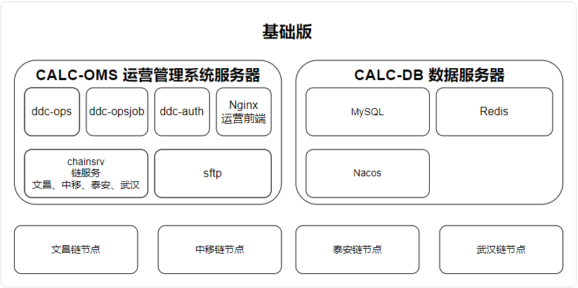
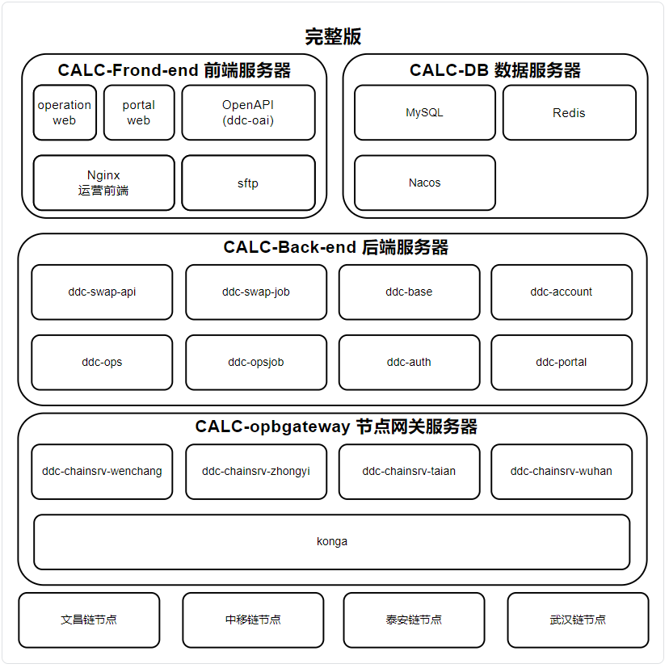
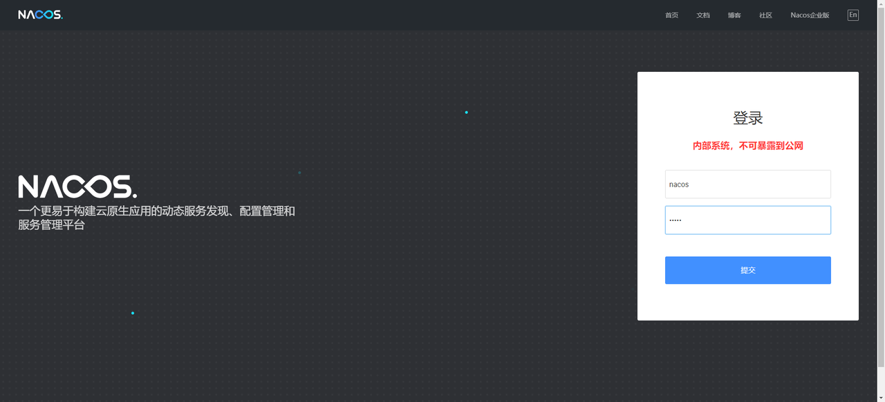
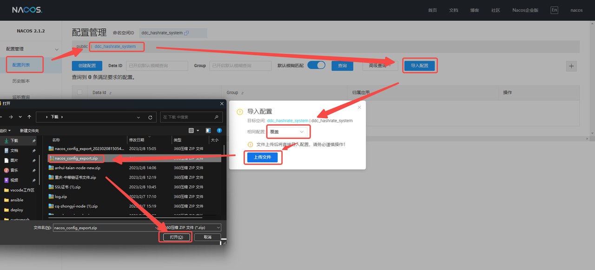
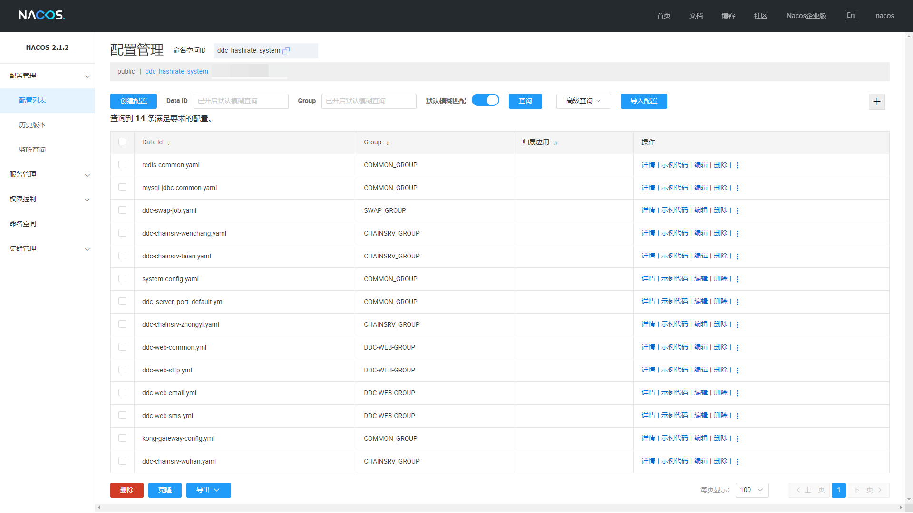
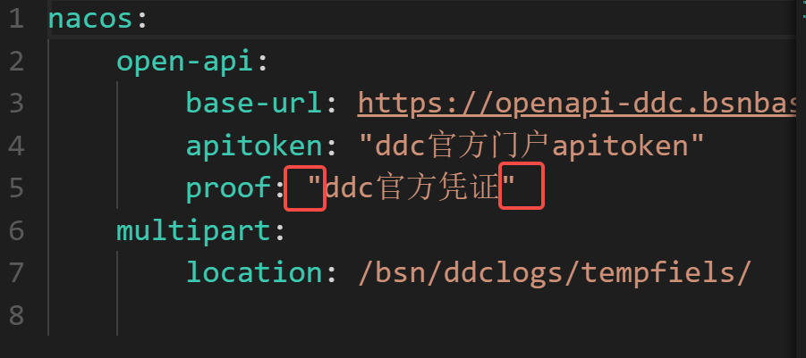
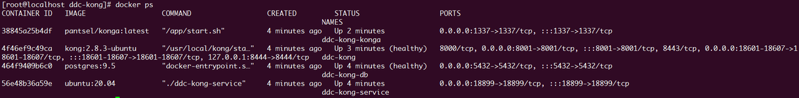
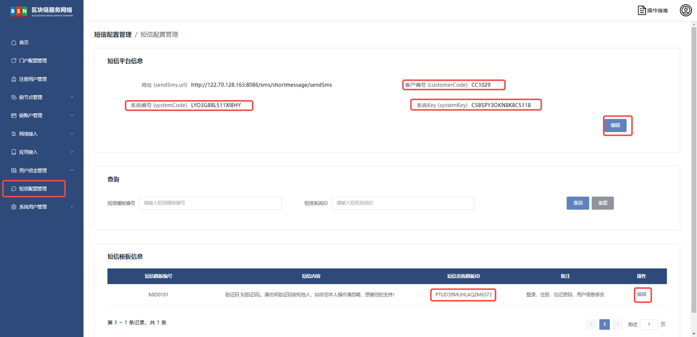

# 算力中心详细部署文档

# 前言

# 一、版本信息

| 文档版本号 | 更新日期 | 算力中心版本号 | 审核人 |
| :--------- | :------- | :------------- | :----- |
| v1.2       | 2023-7-6 | v2.2.3         | 周晓明 |

# 二、变更日志

| <strong>时间</strong> | <strong>版本号</strong> | <strong>变更人</strong> | <strong>主要变更内容</strong>                            |
| --------------------- | ----------------------- | ----------------------- | -------------------------------------------------------- |
| 2023-2-14             | V1.0                    | 周晓明                  | 编写文件大纲及示例                                       |
| 2023-2-14             | V1.1                    | 张云龙                  | 算力中心部署内容填充                                     |
| 2023-6-20             | V1.2                    | 张云龙                  | 调整启动文件下载链接，取消表格单元格合并，新增武汉链说明 |

# 三、名词解释

| <strong>术语 / 缩略词</strong> | <strong>说明</strong> |
| ------------------------------ | --------------------- |
| irisnet                        | 文昌链                |
| eos                            | 中移链                |
| fisco                          | 泰安链                |
| eth                            | 武汉链                |

# 四、环境要求

## 硬件环境

说明应用环境部署所需的硬件资源、包括 cpu、内存、磁盘及服务器的数量要求

> ### 最小配置

<strong>基础版</strong>

| 主机名        | CPU  | Memory | 系统磁盘 | 数据磁盘 | 备注                                  |
| ------------- | ---- | ------ | -------- | -------- | ------------------------------------- |
| CALC-OMS      | 2 核 | 4GB    | 40GB     | 50GB     | 包含运营前端、后端、SFTP 服务、链服务 |
| CALC-DB       | 2 核 | 4GB    | 40GB     | 100GB    | 包含 MySQL、Redis、Nacos 服务         |
| zhongyi-node  | 4 核 | 16GB   | 40GB     | 100GB    | 中移链外部节点                        |
| taian-node    | 2 核 | 8GB    | 40GB     | 300GB    | 泰安链外部节点                        |
| wenchang-node | 4 核 | 16GB   | 40GB     | 800GB    | 文昌链外部节点（裁剪快照启动）        |
| wenchang-node | 8 核 | 32GB   | 40GB     | 2TB      | 文昌链外部节点（全量数据启动）        |
| wuhan-node    | 2 核 | 4GB    | 40GB     | 200GB    | 武汉链外部节点                        |

<strong>标准版</strong>

| 主机名          | CPU  | Memory | 系统磁盘 | 数据磁盘 | 备注                                  |
| --------------- | ---- | ------ | -------- | -------- | ------------------------------------- |
| CALC-OMS        | 2 核 | 4GB    | 40GB     | 50GB     | 包含运营前端、后端、SFTP 服务、链服务 |
| CALC-DB         | 2 核 | 4GB    | 40GB     | 100GB    | 包含 MySQL、Redis、Nacos 服务         |
| CALC-opbgateway | 2 核 | 4GB    | 40GB     | 100GB    | 节点网关服务                          |
| zhongyi-node    | 4 核 | 16GB   | 40GB     | 100GB    | 中移链外部节点                        |
| taian-node      | 2 核 | 8GB    | 40GB     | 300GB    | 泰安链外部节点                        |
| wenchang-node   | 4 核 | 16GB   | 40GB     | 800GB    | 文昌链外部节点（裁剪快照启动）        |
| wenchang-node   | 8 核 | 32GB   | 40GB     | 2TB      | 文昌链外部节点（全量数据启动）        |
| wuhan-node      | 2 核 | 4GB    | 40GB     | 200GB    | 武汉链外部节点                        |

<strong>完整版</strong>

| 主机名          | CPU  | Memory | 系统磁盘 | 数据磁盘 | 备注                              |
| --------------- | ---- | ------ | -------- | -------- | --------------------------------- |
| CALC-Frond-end  | 2 核 | 8GB    | 40GB     | 200GB    | 门户前端、运营前端、openapi、SFTP |
| CALC-Back-end   | 4 核 | 16GB   | 40GB     | 300GB    | 门户后端、运营后端、相关微服务    |
| CALC-opbgateway | 2 核 | 8GB    | 40GB     | 200GB    | 节点关服务、链服务                |
| CALC-DB         | 4 核 | 8GB    | 40GB     | 200GB    | 包含 MySQL、Redis、Nacos 服务     |
| zhongyi-node    | 4 核 | 16GB   | 40GB     | 100GB    | 中移链外部节点                    |
| taian-node      | 2 核 | 8GB    | 40GB     | 300GB    | 泰安链外部节点                    |
| wenchang-node   | 4 核 | 16GB   | 40GB     | 800GB    | 文昌链外部节点（裁剪快照启动）    |
| wenchang-node   | 8 核 | 32GB   | 40GB     | 2TB      | 文昌链外部节点（全量数据启动）    |
| wuhan-node      | 2 核 | 4GB    | 40GB     | 200GB    | 武汉链外部节点                    |

> ### 1.2 推荐配置

<strong>基础版</strong>

| 主机名        | CPU  | Memory | 系统磁盘 | 数据磁盘 | 备注                              |
| ------------- | ---- | ------ | -------- | -------- | --------------------------------- |
| CALC-OMS      | 4 核 | 8GB    | 40GB     | 50GB     | 包含前端、后端、SFTP 服务、链服务 |
| CALC-DB       | 4 核 | 8GB    | 40GB     | 200GB    | 包含 MySQL、Redis、Nacos 服务     |
| zhongyi-node  | 8 核 | 32GB   | 40GB     | 200GB    | 中移链外部节点                    |
| taian-node    | 4 核 | 16GB   | 40GB     | 300GB    | 泰安链外部节点                    |
| wenchang-node | 4 核 | 32GB   | 40GB     | 800GB    | 文昌链外部节点（裁剪快照启动）    |
| wenchang-node | 8 核 | 64GB   | 40GB     | 2TB      | 文昌链外部节点（全量数据启动）    |
| wuhan-node    | 4 核 | 16GB   | 40GB     | 200GB    | 武汉链外部节点                    |

<strong>标准版</strong>

| 主机名          | CPU  | Memory | 系统磁盘 | 数据磁盘 | 备注                              |
| --------------- | ---- | ------ | -------- | -------- | --------------------------------- |
| CALC-OMS        | 4 核 | 8GB    | 40GB     | 50GB     | 包含前端、后端、SFTP 服务、链服务 |
| CALC-DB         | 4 核 | 8GB    | 40GB     | 200GB    | 包含 MySQL、Redis、Nacos 服务     |
| CALC-opbgateway | 4 核 | 8GB    | 40GB     | 100GB    | 节点网关服务                      |
| zhongyi-node    | 8 核 | 32GB   | 40GB     | 200GB    | 中移链外部节点                    |
| taian-node      | 4 核 | 16GB   | 40GB     | 300GB    | 泰安链外部节点                    |
| wenchang-node   | 4 核 | 32GB   | 40GB     | 800GB    | 文昌链外部节点（裁剪快照启动）    |
| wenchang-node   | 8 核 | 64GB   | 40GB     | 2TB      | 文昌链外部节点（全量数据启动）    |
| wuhan-node      | 4 核 | 16GB   | 40GB     | 200GB    | 武汉链外部节点                    |

<strong>完整版</strong>

| 主机名          | CPU  | Memory | 系统磁盘 | 数据磁盘 | 备注                              |
| --------------- | ---- | ------ | -------- | -------- | --------------------------------- |
| CALC-Frond-end  | 4 核 | 8GB    | 40GB     | 200GB    | 门户前端、运营前端、openapi、SFTP |
| CALC-Back-end   | 8 核 | 32GB   | 40GB     | 300GB    | 门户后端、运营后端、相关微服务    |
| CALC-opbgateway | 8 核 | 16GB   | 40GB     | 200GB    | 节点关服务、链服务                |
| CALC-DB         | 8 核 | 16GB   | 40GB     | 200GB    | 包含 MySQL、Redis、Nacos 服务     |
| zhongyi-node    | 8 核 | 32GB   | 40GB     | 200GB    | 中移链外部节点                    |
| taian-node      | 4 核 | 16GB   | 40GB     | 300GB    | 泰安链外部节点                    |
| wenchang-node   | 4 核 | 32GB   | 40GB     | 800GB    | 文昌链外部节点（裁剪快照启动）    |
| wenchang-node   | 8 核 | 64GB   | 40GB     | 2TB      | 文昌链外部节点（全量数据启动）    |
| wuhan-node      | 4 核 | 16GB   | 40GB     | 200GB    | 武汉链外部节点                    |

## 软件环境

### 系统基础软件环境

| 分类     | 软件                  | 版本      | 备注                                                   |
| -------- | --------------------- | --------- | ------------------------------------------------------ |
| 操作系统 | CentOS                | 7.6+      |                                                        |
| 操作系统 | Ubuntu                | 22.04     |                                                        |
| 系统内核 | kernel                | 3.10.0+   | 系统内核版本                                           |
| 系统架构 | x86_64                | x86_64    | CPU 架构                                               |
| 基础环境 | docker-ce             | 20.10.21+ |                                                        |
| 基础环境 | docker-compose-plugin | 2.15.1+   | 替代 docker-compose，yum 安装                          |
| 基础环境 | python3               | 3.6+      | 仅在 CALC-DB 服务器上安装即可，<strong>非必要</strong> |
| 基础环境 | 基础命令              |           | telent、zip、unzip、vim、sshpass、wget、curl、tree、jq |
| 基础环境 | ansible               | 4.10.0    | 仅在 CALC-DB 服务器上安装即可，<strong>非必要</strong> |

### 应用软件环境

| 分类               | 软件                                          | 版本       | 备注                                    |
| ------------------ | --------------------------------------------- | ---------- | --------------------------------------- |
| 中间件             | redis:6.0.5                                   | 6.0.5      |                                         |
| 数据库             | mysql:5.7.39                                  | 5.7.39+    | 关注版本漏洞选择 5.7.x 的版本           |
| docker 镜像        | Oracle JDK                                    | 1.8.0_351+ | <strong>链服务</strong>容器内部环境     |
| docker 镜像        | nacos/nacos-server:v2.1.2                     | v2.1.2     |                                         |
| docker 镜像        | Oracle JDK                                    | 11.0.16.1+ | <strong>后端微服务</strong>容器内部环境 |
| docker 镜像-中间件 | openresty/openresty:1.21.4.1-6-bullseye-amd64 | 1.21.4.1   | nginx 服务                              |
| docker 镜像-中间件 | atmoz/sftp:debian                             |            | sftp 服务                               |
| docker 镜像-中间件 | kong:2.8.3-ubuntu                             |            | konga 节点网关使用                      |
| docker 镜像-中间件 | postgres:9.5                                  |            | konga 节点网关使用                      |
| docker 镜像-系统   | ubuntu:20.04                                  |            | konga 节点网关使用                      |
| docker 镜像-链节点 | bsnddc/wenchangchain:4.0.0                    |            |                                         |
| docker 镜像-链节点 | bsnddc/zhongyichain:v2.0.0                    |            |                                         |
| docker 镜像-链节点 | bsnddc/taianchain:v2.8.0                      |            |                                         |
| docker 镜像-链节点 | bsnddc/wuhanchain:v1.2.16                     |            |                                         |

## 网络环境

<strong>数据服务</strong>

| 服务名称 | 端口号 | 端口用途          | 端口开放对象     |
| -------- | ------ | ----------------- | ---------------- |
| mysql    | 3306   | 数据库            | 对服务器内部开放 |
| redis    | 6379   | 缓存服务          | ..               |
| sftp     | 8012   | 文件服务          | ..               |
| nacos    | 8848   | 配置&注册中心服务 | 对管理员开放     |

<strong>微服务</strong>

| 服务名称              | 端口号 | 端口说明              | 端口开放对象     |
| --------------------- | ------ | --------------------- | ---------------- |
| ddc-portal            | 8080   | 门户后端服务          | 对服务器内部开放 |
| ddc-opsjob            | 8061   | 运营后端计划任务服务  | ..               |
| ddc-account           | 8072   | 账户服务              | ..               |
| ddc-base              | 8071   | 算力中心基础服务      | ..               |
| ddc-ops               | 8081   | 运营后端服务          | ..               |
| ddc-auth              | 8091   | 算力中心权限服务      | ..               |
| ddc-oai               | 18080  | 算力中心 OpenAPI 服务 | ..               |
| ddc-swap-api          | 9070   | 交易服务              | ..               |
| ddc-swap-job          | 38021  | 交易 job 服务         | ..               |
| ddc-chainsrv-wenchang | 32010  | 文昌链服务            | ..               |
| ddc-chainsrv-taian    | 32020  | 泰安链服务            | ..               |
| ddc-chainsrv-zhongyi  | 32030  | 中移链服务            | ..               |
| ddc-chainsrv-wuhan    | 32040  | 武汉链服务            | ..               |

<strong>openresty-ngx（Nginx）</strong>

| 端口号 | 端口用途                                | 端口开放对象 |
| ------ | --------------------------------------- | ------------ |
| 18601  | kong 节点网关代理 http/websocket 端口   | 对外开放     |
| 18602  | kong 节点网关代理 https/websockets 端口 | ..           |
| 18603  | kong 节点网关代理 grpcs 端口            | ..           |
| 18605  | kong 节点网关代理 grpc 端口             | ..           |
| 8440   | 运营页面访问端口                        | ..           |
| 8441   | 门户页面访问端口                        | ..           |
| 8442   | OpenAPI 服务代理端口                    | ..           |

<strong>kong 节点网关</strong>

| 端口号 | 端口说明              | 端口开放对象          |
| ------ | --------------------- | --------------------- |
| 18601  | http/websocket 端口   | 对 openresty-ngx 开放 |
| 18602  | https/websockets 端口 | ..                    |
| 18603  | grpcs 端口            | ..                    |
| 18605  | grpc 端口             | ..                    |
| 1337   | kong 节点网关管理端口 | 对管理员开放          |

## 域名配置

### 算力中心内部服务主机域名配置 /etc/hosts

| 服务名称               | 域名                       | 示例名称IP         | 内网IP地址             |
| :--------------------- | :------------------------- | :----------------- | ---------------------- |
| mysql                  | calc.datacenter.mysql      | CALC-DB-ip地址     | 根据实际内网IP地址填写 |
| redis                  | calc.datacenter.redis      | ..                 | ..                     |
| nacos                  | calc.datacenter.nacos      | ..                 | ..                     |
| sftp                   | calc.datacenter.sftp       | sftp-ip地址        | ..                     |
| ddc-oai（OpenAPI）     | calc.datacenter.openapi    | openapi-IP地址     | ..                     |
| kong节点网关           | calc.datacenter.opbgateway | kong节点网关ip地址 | ..                     |
| ddc-ops（运营后端）    | calc.datacenter.operation  | 运营后端IP         | ..                     |
| ddc-portal（门户后端） | calc.datacenter.portal     | portal             | ..                     |

示例内容：

需要修改 <strong>示例名称 IP</strong> 为 <strong>实际 IP 地址</strong>

```bash
sudo sh -c 'sudo cat > /etc/hosts <<EOF
# CentOS7.x 系列主机默认的hosts
127.0.0.1   localhost localhost.localdomain localhost4 localhost4.localdomain4
::1         localhost localhost.localdomain localhost6 localhost6.localdomain6

# 以下第一列为<strong> 示例名称IP </strong>是需要做修改的内容
CALC-DB-ip地址          calc.datacenter.redis calc.datacenter.mysql calc.datacenter.nacos
sftp-ip地址             calc.datacenter.sftp
kong节点网关ip地址       calc.datacenter.opbgateway
openapi-IP地址          calc.datacenter.openapi
运营后端IP              calc.datacenter.operation
门户后端IP              calc.datacenter.portal
EOF'
```

Ubuntu

### 域名配置

域名根据实际需要求进行替换

| 服务名称   | 域名                |
| ---------- | ------------------- |
| 运营       | operation.xxxx.com  |
| 门户       | portal.xxxx.com     |
| openapi    | openapi.xxxx.com    |
| opbgateway | opbgateway.xxxx.com |

## 系统预置账号

| 服务名称                                          | 用户名   | 密码                                            | 备注                             |
| ------------------------------------------------- | -------- | ----------------------------------------------- | -------------------------------- |
| MySQL                                             | root     | datacenter@calcmysqlmailto:datacenter@calcmysql |                                  |
| Redis                                             |          | datacenter@calcredismailto:datacenter@calcredis |                                  |
| Nacos                                             | nacos    | nacos                                           |                                  |
| Sftp                                              | calcsftp | datacenter@calcsftpmailto:datacenter@calcsftp   |                                  |
| 运营系统                                          | admin    | ZEFS2viaOwz3                                    |                                  |
| Nacos 的 <strong>kong-gateway-config.yml</strong> | admin    | datacenter@calckongamailto:datacenter@calckonga | 与 kong 节点网关 Basic Auth 对应 |
| kong 节点网关 Basic Auth                          | admin    | datacenter@calckongamailto:datacenter@calckonga | 需要手动创建                     |
|                                                   |          |                                                 |                                  |

# 五、环境准备

## 环境验证

### 硬件环境验证

cpu 核数验证

```shell
cat /proc/cpuinfo | grep -i "model name" | wc -l
```

内存大小验证

```shell
free -h
```

磁盘大小验证

```shell
df -h
```

输出结果：

```shell
[root@localhost ~]# cat /proc/cpuinfo | grep -i "model name" | wc -l
4
[root@localhost ~]# free -h
              total        used        free      shared  buff/cache   available
Mem:            15G        262M         13G         16M        2.1G         14G
Swap:            0B          0B          0B
[root@localhost ~]# df -h
Filesystem      Size  Used Avail Use% Mounted on
/dev/nvme0n1p1   30G  7.9G   23G  27% /
devtmpfs        7.7G     0  7.7G   0% /dev
tmpfs           7.7G     0  7.7G   0% /dev/shm
tmpfs           7.7G   17M  7.7G   1% /run
tmpfs           7.7G     0  7.7G   0% /sys/fs/cgroup
/dev/nvme1n1p1  200G   33M  200G   1% /bsn
tmpfs           1.6G     0  1.6G   0% /run/user/1018
```

### 系统基础环境验证

系统发行版本、内核、CPU 架构验证

```shell
cat /etc/os-release 
cat /etc/redhat-release
uname -r
uname -m
```

输出结果：

```shell
[root@localhost ddc-back-service]# cat /etc/os-release 
NAME="CentOS Linux"
VERSION="7 (Core)"
ID="centos"
ID_LIKE="rhel fedora"
VERSION_ID="7"
PRETTY_NAME="CentOS Linux 7 (Core)"
ANSI_COLOR="0;31"
CPE_NAME="cpe:/o:centos:centos:7"
HOME_URL="https://www.centos.org/"
BUG_REPORT_URL="https://bugs.centos.org/"

CENTOS_MANTISBT_PROJECT="CentOS-7"
CENTOS_MANTISBT_PROJECT_VERSION="7"
REDHAT_SUPPORT_PRODUCT="centos"
REDHAT_SUPPORT_PRODUCT_VERSION="7"

[root@localhost ddc-back-service]# cat /etc/redhat-release
CentOS Linux release 7.5.1804 (Core) 
[root@localhost ddc-back-service]# uname -r
3.10.0-862.3.2.el7.x86_64
[root@localhost ddc-back-service]# uname -m
x86_64
```

docker 验证

```shell
docker version
```

输出结果：

```shell
[root@localhost ~]# docker version
Client: Docker Engine - Community
 Version:           23.0.1
 API version:       1.42
 Go version:        go1.19.5
 Git commit:        a5ee5b1
 Built:             Thu Feb  9 19:51:00 2023
 OS/Arch:           linux/amd64
 Context:           default

Server: Docker Engine - Community
 Engine:
  Version:          23.0.1
  API version:      1.42 (minimum version 1.12)
  Go version:       go1.19.5
  Git commit:       bc3805a
  Built:            Thu Feb  9 19:48:42 2023
  OS/Arch:          linux/amd64
  Experimental:     false
 containerd:
  Version:          1.6.18
  GitCommit:        2456e983eb9e37e47538f59ea18f2043c9a73640
 runc:
  Version:          1.1.4
  GitCommit:        v1.1.4-0-g5fd4c4d
 docker-init:
  Version:          0.19.0
  GitCommit:        de40ad0
```

docker compose 验证

```shell
docker compose version
```

输出结果：

```shell
[root@localhost ~]# docker compose version
Docker Compose version v2.16.0
```

## 环境配置

### 系统参数优化

需要修改/etc/sysctl.conf 文件

```bash
sudo sh -c 'cat >> /etc/sysctl.conf <<EOF
fs.inotify.max_user_watches=100000
net.ipv4.icmp_echo_ignore_broadcasts = 1
net.ipv4.icmp_ignore_bogus_error_responses = 1
kernel.sysrq = 0
kernel.core_uses_pid = 1
net.ipv4.tcp_syncookies = 1
kernel.msgmnb = 65536
kernel.msgmax = 65536
net.ipv4.tcp_tw_reuse = 1
net.ipv4.tcp_mem = 94500000 915000000 927000000
net.ipv4.tcp_fin_timeout = 1
net.ipv4.tcp_keepalive_time = 30
net.ipv4.ip_local_port_range = 1024    65000
net.core.somaxconn = 65535
vm.overcommit_memory = 1
EOF'
```

输出结果

```shell
[root@localhost ~]# sudo vim /etc/sysctl.conf
You have new mail in /var/spool/mail/root
[root@localhost ~]# cat /etc/sysctl.conf
fs.inotify.max_user_watches=100000
net.ipv4.icmp_echo_ignore_broadcasts = 1
net.ipv4.icmp_ignore_bogus_error_responses = 1
kernel.sysrq = 0
kernel.core_uses_pid = 1
net.ipv4.tcp_syncookies = 1
kernel.msgmnb = 65536
kernel.msgmax = 65536
net.ipv4.tcp_tw_reuse = 1
net.ipv4.tcp_mem = 94500000 915000000 927000000
net.ipv4.tcp_fin_timeout = 1
net.ipv4.tcp_keepalive_time = 30
net.ipv4.ip_local_port_range = 1024    65000
net.core.somaxconn = 65535
vm.overcommit_memory = 1
```

使其内核参数即刻生效

```bash
sysctl -p
```

关闭透明巨页内存配置

临时生效

```bash
sudo echo never > /sys/kernel/mm/transparent_hugepage/enabled
```

永久生效，加入开机自启动

```bash
sudo echo "echo never > /sys/kernel/mm/transparent_hugepage/enabled" >> /etc/rc.local
```

赋予执行权限

```bash
sudo chmod +x /etc/rc.local
```

总体输出结果

```shell
[root@localhost ~]# cat /sys/kernel/mm/transparent_hugepage/enabled
always madvise [never]
[root@localhost ~]# cat /etc/rc.local
#!/bin/bash
# THIS FILE IS ADDED FOR COMPATIBILITY PURPOSES
#
# It is highly advisable to create own systemd services or udev rules
# to run scripts during boot instead of using this file.
#
# In contrast to previous versions due to parallel execution during boot
# this script will NOT be run after all other services.
#
# Please note that you must run 'chmod +x /etc/rc.d/rc.local' to ensure
# that this script will be executed during boot.

touch /var/lock/subsys/local
echo never > /sys/kernel/mm/transparent_hugepage/enabled
```

### 用户文件打开数优化

追加配置

```bash
sudo sh -c 'sudo cat >> /etc/security/limits.conf <<EOF
* soft nofile 65535
* hard nofile 65535
root soft nofile 102400
root hard nofile 102400
EOF'
```

输出结果

```shell
cat /etc/security/limits.conf
* soft nofile 65535
* hard nofile 65535
root soft nofile 102400
root hard nofile 102400
```

### 挂载数据盘

### docker-ce 配置

编辑 daemon.json 文件

```bash
sudo sh -c 'sudo cat >/etc/docker/daemon.json <<EOF
{
"registry-mirrors": ["http://hub-mirror.c.163.com"],
"data-root": "/bsn/docker",
"log-driver": "json-file",
"log-opts": {"max-size":"500m", "max-file":"3"}
}
EOF'
```

输出结果

```
cat /etc/docker/daemon.json
{
"registry-mirrors": ["http://hub-mirror.c.163.com"],
"data-root": "/bsn/docker",
"log-driver": "json-file",
"log-opts": {"max-size":"500m", "max-file":"3"}
}
```

加载一次 docker 配置

```bash
sudo systemctl daemon-reload
```

启动 docker

```
sudo systemctl start docker
```

将 docker 设置开机自启动

```
sudo systemctl enable docker
```

### ntp 时钟服务

设置时区为 Asia/Shanghai

```bash
tzselect <<EOF
5
9
1
1
EOF
rm -f /etc/localtime
ln -s /usr/share/zoneinfo/Asia/Shanghai /etc/localtime
```

安装 ntp 服务

```shell
yum -y install ntp
```

编辑/etc/ntp.conf 文件，修改时间服务器配置

```bash
sudo sed -i  "s/^server/#server/g" /etc/ntp.conf
sudo sh -c "sudo cat >>/etc/ntp.conf<<EOF
server ntp1.aliyun.com iburst
server ntp2.aliyun.com iburst
server ntp3.aliyun.com iburst
server ntp4.aliyun.com iburst
EOF"
```

重启服务

```shell
systemctl restart ntpd
```

验证结果

```shell
[root@localhost ~]# ntpq -p
     remote           refid      st t when poll reach   delay   offset  jitter
==============================================================================
+120.25.115.20   10.137.53.7      2 u   32   64    1   56.627   -4.297   0.088
*203.107.6.88    10.137.38.86     2 u   31   64    1   43.631    9.504   0.154
```

### 关闭防火墙

CentOS 关闭 firewalld

```bash
systemctl stop firewalld
systemctl disable firewalld
```

Ubuntu 22.04 关闭 firewalld

```bash
systemctl stop ufw
systemctl disable ufw
```

关闭 Seliunx

ubuntu 需要安装 policycoreutils-python-utils

```bash
apt install policycoreutils-python-utils
```

```bash
setenforce 0
sed -i 's/SELINUX=enforcing/SELINUX=disabled/g' /etc/selinux/config
```

## 网络验证

服务开放端口验证（部署完成之后再次验证）

验证外网是否正常通信

```bash
ping -c 1 114.114.114.114
telnet www.bsnbase.com 443
```

输出结果：

```bash
[root@localhost]# ping -c 1 www.baidu.com
PING www.a.shifen.com (x.x.x.x) 56(84) bytes of data.
64 bytes from x.x.x.x (x.x.x.x): icmp_seq=1 ttl=43 time=34.7 ms

--- www.a.shifen.com ping statistics ---
1 packets transmitted, 1 received, 0% packet loss, time 0ms
rtt min/avg/max/mdev = 34.723/34.723/34.723/0.000 ms
[root@localhost]# telnet www.bsnbase.com 443
Trying x.x.x.x...
Connected to www.bsnbase.com.
Escape character is '^]'.
^]
telnet> quit
Connection closed.
```

验证服务器自身公网 IP

```bash
curl cip.cc
```

输出结果：

```bash
[root@localhost ~]# curl cip.cc
IP        : x.x.x.x
地址        : 美国  美国

数据二        : 美国

数据三        : 中国宁夏中卫市 | 移动

URL        : http://www.cip.cc/x.x.x.x
```

验证服务器之间通过内网 IP 是否正常通信

```bash
[root@localhost ~]# ping 10.0.x.x
PING 10.0.x.x (10.0.x.x) 56(84) bytes of data.
64 bytes from 10.0.x.x: icmp_seq=1 ttl=64 time=0.591 ms
64 bytes from 10.0.x.x: icmp_seq=2 ttl=64 time=0.206 ms
^C
--- 10.0.x.x ping statistics ---
2 packets transmitted, 2 received, 0% packet loss, time 1000ms
rtt min/avg/max/mdev = 0.206/0.398/0.591/0.193 m
```

缺少端口验证脚本

# 六、项目应用相关资料

## 项目资料下载地址

```
https://data-center.s3.cn-northwest-1.amazonaws.com.cn/index.html
```

## 应用部署文件

| 服务名称              | 服务版本  | 服务说明         | 备注 |
| --------------------- | --------- | ---------------- | ---- |
| ddc-opsjob            |           | 运营 job         |      |
| ddc-auth              |           | 运营权限服务     |      |
| ddc-swap-api          |           | 交易服务         |      |
| ddc-swap-job          |           | 交易 job 服务    |      |
| ddc-base              |           | 基础服务         |      |
| ddc-account           |           | 帐户服务         |      |
| ddc-ops               |           | 运营系统后端服务 |      |
| ddc-portal            |           | 门户后端服务     |      |
| ddc-oai               |           | 算力中心 OpenAPI |      |
| ddc-chainsrv-zhongyi  |           | 中移链服务       |      |
| ddc-chainsrv-wenchang |           | 文昌链服务       |      |
| ddc-chainsrv-taian    |           | 泰安链服务       |      |
| ddc-chainsrv-wuhan    |           | 武汉链服务       |      |
| portal-web            |           | 门户前端页面     |      |
| operation-web         |           | 运营系统前端页面 |      |
| OracleJDK11           | 11.16.0.1 | JDK11 环境包     |      |
| OracleJDK8            | 1.8.0     | JDK8 环境包      |      |

## 数据库初始化

> 根据实际情况，有 sql 需要填写，提供脚本

| 执行顺序 | 文件名称         | 执行库名     | 执行权限或用户 | 执行后检查      |
| -------- | ---------------- | ------------ | -------------- | --------------- |
| 1        | mysql-schema.sql | ddc_hashrate | root           | show databases; |

## docker-compose 启动文件

| 文件名称                   | 包含服务                                                                                     | 备注                                                        |
| -------------------------- | -------------------------------------------------------------------------------------------- | ----------------------------------------------------------- |
| base.tar.gz                | mysql、redis、nacos                                                                          |                                                             |
| sftp.tar.gz                | sftp                                                                                         |                                                             |
| ddc-back-service-bs.tar.gz | ddc-ops、ddc-opsjob、ddc-auth                                                                | <strong>标准版</strong>&&<strong>基础版</strong> 后端微服务 |
| ddc-back-service.tar.gz    | ddc-swap-api、ddc-swap-job、ddc-base、ddc-account、ddc-ops、ddc-opsjob、ddc-auth、ddc-portal | <strong>完整版</strong> 后端微服务                          |
| ddc-nginx-basic.tar.gz     | opertaion 代理配置                                                                           | <strong>基础版</strong> Nginx 前端服务                      |
| ddc-nginx-standard.tar.gz  | opertaion、opbgateway 代理配置                                                               | <strong>标准版</strong> Nginx 前端服务                      |
| ddc-nginx.tar.gz           | portalopertaionopbgatewayopenapi 代理配置                                                    | <strong>完整版</strong> Nginx 前端服务                      |
| chainsrv.tar.gz            | ddc-chainsrv-zhongyiddc-chainsrv-taianddc-chainsrv-wenchangddc-chainsrv-wuhan                | 链服务启动文件                                              |
| taian-node.tar.gz          | 泰安链外部节点启动文件                                                                       |                                                             |
| wenchang-node.tar.gz       | 文昌链外部节点启动文件                                                                       |                                                             |
| zhongyi-node.tar.gz        | 中移链外部节点启动文件                                                                       |                                                             |
| wuhan-node.tar.gz          | 武汉连外部节点启动文件                                                                       |                                                             |
| ddc-kong-gateway-main      | 空节点网关                                                                                   |                                                             |

## Nacos 应用配置文件

| 文件名称                | 文件说明                   | 备注                 |
| ----------------------- | -------------------------- | -------------------- |
| nacos_config_export.zip | 后端微服务、链服务使用配置 | 提前下载到本地准备好 |

```
# 下载链接
https://data-center.s3.cn-northwest-1.amazonaws.com.cn/startup-file/config-files/nacos_config_export.zip
```

# 七、应用部署

## 部署结构图

### 基础版



### 标准版


### 完整版



## 数据服务部署

下载 <strong>mysql.tar.gz、redis.tar.gz、nacos.tar.gz</strong>到 <strong>CALC-DB </strong>服务器的<strong> /</strong><strong>bsn</strong> 目录并解压

```bash
wget -P /bsn/ https://data-center.s3.cn-northwest-1.amazonaws.com.cn/startup-files/docker/mysql.tar.gz
```

```bash
wget -P /bsn/ https://data-center.s3.cn-northwest-1.amazonaws.com.cn/startup-files/docker/redis.tar.gz
```

```bash
wget -P /bsn/ https://data-center.s3.cn-northwest-1.amazonaws.com.cn/startup-files/docker/nacos.tar.gz
```

解压

```bash
tar -xzvf /bsn/mysql.tar.gz -C /bsn/
tar -xzvf /bsn/redis.tar.gz -C /bsn/
tar -xzvf /bsn/nacos.tar.gz -C /bsn/
```

目录结构

```bash
tree -L 3 /bsn/
```

```
[root@localhost bsn]# tree -L 3 /bsn/
├── base.tar.gz
├── mysql
│   ├── conf
│   │   └── my.cnf
│   ├── docker-compose.yml
│   └── script
├── nacos
│   ├── conf
│   │   └── application.properties
│   └── docker-compose.yml
└── redis
    ├── conf
    │   └── redis.conf
    └── docker-compose.yml
```

### MySQL 部署

下载数据库初始化 SQL 脚本 <strong>mysql-schema.sql</strong><strong> </strong>上传到 <strong>CALC-DB </strong>服务器 /bsn/mysql/script

```bash
wget -O /bsn/mysql/script/mysql-schema.sql https://data-center.s3.cn-northwest-1.amazonaws.com.cn/<最新版本号>/deployPackageAndConfiguration/database/mysql/mysql-schema.sql
```

调整 mysql 配置文件权限

```
sudo chmod 644 /bsn/mysql/conf/my.cnf
```

进入到 mysql 工作目录启动 mysql 容器

```bash
cd /bsn/mysql
```

MySQL 默认 root 密码：datacenter@calcmysql

根据实际需求修改，不修改直接跳转到<strong> </strong><strong>启动 mysql 服务</strong>

docker-compose.yml 文件内容

```yaml
version: '3'
services:
  mysql:
    image: mysql:5.7.39
    restart: always
    container_name: mysql
    environment:
      MYSQL_ROOT_PASSWORD: datacenter@calcmysql # 自己设置
      TZ: Asia/Shanghai
    ports:
      - 3306:3306
    volumes:
      - ./data:/var/lib/mysql
      - ./conf/my.cnf:/etc/mysql/my.cnf
      - ./script:/mysql-script
      - /etc/hosts:/etc/hosts
    command:
      --max_connections=100000
      --character-set-server=utf8
      --collation-server=utf8mb4_general_ci
      --default-authentication-plugin=mysql_native_password
```

修改 MySQL 默认 root 密码

```bash
sudo sed -e "s|datacenter@calcmysql|<new password>|g" -i.bak /bsn/mysql/docker-compose.yml
```

保存退出并启动 mysql 服务

```bash
docker compose up -d
```

输出结果

```yaml
[+] Running 12/12
 ⠿ mysql Pulled                                      28.5s
   ⠿ 0056409b8e89 Pull complete                      11.5s
   ⠿ 219bd535343d Pull complete                      11.6s
   ⠿ f220ee65eb90 Pull complete                      11.7s
   ⠿ 7bbb395b2290 Pull complete                      11.9s
   ⠿ 645e487e5f0a Pull complete                      12.0s
   ⠿ 266b96d99da2 Pull complete                      12.1s
   ⠿ 5b1965015916 Pull complete                      13.9s
   ⠿ 5f5976bb40e4 Pull complete                      15.3s
   ⠿ d7dde9165879 Pull complete                      24.6s
   ⠿ 604d9c61b759 Pull complete                      24.7s
   ⠿ cdd75db38492 Pull complete                      24.8s
[+] Running 2/2
 ⠿ Network mysql_default  Created                     0.2s
 ⠿ Container mysql        Starte...                   0.5s
```

查看容器日志是否正常启动

```yaml
docker logs -f --tail 10 mysql
```

输出结果

```yaml
[root@localhost redis]# docker logs -f --tail 10 mysql
2023-02-15T17:22:19.392784Z 0 [Warning] CA certificate ca.pem is self signed.
2023-02-15T17:22:19.392835Z 0 [Note] Skipping generation of RSA key pair as key files are present in data directory.
2023-02-15T17:22:19.393082Z 0 [Note] Server hostname (bind-address): '*'; port: 3306
2023-02-15T17:22:19.393705Z 0 [Note] IPv6 is available.
2023-02-15T17:22:19.393732Z 0 [Note]   - '::' resolves to '::';
2023-02-15T17:22:19.393753Z 0 [Note] Server socket created on IP: '::'.
2023-02-15T17:22:19.394899Z 0 [Warning] Insecure configuration for --pid-file: Location '/var/run/mysqld' in the path is accessible to all OS users. Consider choosing a different directory.
2023-02-15T17:22:19.400298Z 0 [Note] Event Scheduler: Loaded 0 events
2023-02-15T17:22:19.400547Z 0 [Note] mysqld: ready for connections.
Version: '5.7.39'  socket: '/var/run/mysqld/mysqld.sock'  port: 3306  MySQL Community Server (GPL)
```

登录 mysql 服务

```yaml
docker exec -it mysql bash -c "mysql -uroot -p"
```

输入密码

```bash
Enter password: *******
```

登录成功

```bash
Welcome to the MySQL monitor.  Commands end with ; or \g.
Your MySQL connection id is 2
Server version: 5.7.39 MySQL Community Server (GPL)

Copyright (c) 2000, 2022, Oracle and/or its affiliates.

Oracle is a registered trademark of Oracle Corporation and/or its
affiliates. Other names may be trademarks of their respective
owners.

Type 'help;' or '\h' for help. Type '\c' to clear the current input statement.

mysql>
```

初始化数据库

```bash
source /mysql-script/mysql-schema.sql
```

输出结果：

```bash
...

Query OK, 1 row affected (0.00 sec)

Query OK, 1 row affected (0.00 sec)

Query OK, 1 row affected (0.00 sec)

Query OK, 1 row affected (0.00 sec)

Query OK, 1 row affected (0.00 sec)

Query OK, 1 row affected (0.00 sec)

Query OK, 1 row affected (0.00 sec)

Query OK, 1 row affected (0.00 sec)
```

查看 <strong>ddc_hashrate </strong>数据库是否正常创建

```bash
show databases;
```

输出结果

```
mysql> show databases;
+--------------------+
| Database           |
+--------------------+
| information_schema |
| ddc_hashrate       |
| mysql              |
| performance_schema |
| sys                |
+--------------------+
5 rows in set (0.00 sec)
```

### Redis 部署

进入到 redis 工作目录启动 redis 容器

```bash
cd /bsn/redis
```

redis 默认密码：datacenter@calcredis

根据实际需求修改，不修改直接跳转到 <strong>启动 redis 服务</strong>

docker-compose.yaml 文件内容

查看

```shell
cat /bsn/redis/docker-compose.yml
```

输出结果

```bash
version: '3'
services:
  redis:
    image: 'redis:6.0.5'
    container_name: 'redis'
    restart: always
    tty: true
    volumes:
      - ./data:/data
      - ./conf/redis.conf:/etc/redis/redis.conf
      - ./logs:/logs
    ports:
      - 6379:6379
    command:
      - /bin/bash
      - -c
      - |
        echo 65535 > /proc/sys/net/core/somaxconn
        redis-server --requirepass "datacenter@calcredis"  # 自己设置密码
    privileged: true
```

修改 redis 配置文件、设置 redis 密码

```bash
sudo sed -e "s|datacenter@calcredis|<new password>|g" -i.bak /bsn/redis/docker-compose.yml
```

保存退出并启动 redis 服务

```bash
docker compose up -d
```

输出结果：

```yaml
[+] Running 7/7
 ⠿ redis Pulled                                                                  11.5s
   ⠿ 8559a31e96f4 Pull complete                                                   7.3s
   ⠿ 85a6a5c53ff0 Pull complete                                                   7.4s
   ⠿ b69876b7abed Pull complete                                                   7.5s
   ⠿ a72d84b9df6a Pull complete                                                   7.9s
   ⠿ 5ce7b314b19c Pull complete                                                   8.0s
   ⠿ 04c4bfb0b023 Pull complete                                                   8.0s
[+] Running 2/2
 ⠿ Network redis_default  Created                                                 0.2s
 ⠿ Container redis        Started                                                 0.5s
```

查看 redis 容器日志是否正常启动

```yaml
docker logs -f --tail 10 redis
```

输出结果

```yaml
[root@localhost redis]# docker logs -f --tail 10 redis
  `-._    `-._`-.__.-'_.-'    _.-'                                   
 |`-._`-._    `-.__.-'    _.-'_.-'|                                  
 |    `-._`-._        _.-'_.-'    |                                  
  `-._    `-._`-.__.-'_.-'    _.-'                                   
      `-._    `-.__.-'    _.-'                                       
          `-._        _.-'                                           
              `-.__.-'                                               

1:M 15 Feb 2023 17:36:09.161 # Server initialized
1:M 15 Feb 2023 17:36:09.161 * Ready to accept connections
```

### Nacos 部署

进入到 nacos 工作目录启动 nacos 容器

```bash
cd /bsn/nacos
```

启动服务

```bash
docker compose up -d
```

输出结果：

```
[+] Running 11/11
 ⠿ nacos Pulled                                                                  44.1s
   ⠿ 2d473b07cdd5 Pull complete                                                  19.9s
   ⠿ ca3f558c56d0 Pull complete                                                  20.0s
   ⠿ d6734b3009b6 Pull complete                                                  37.6s
   ⠿ fa99494f35d6 Pull complete                                                  38.5s
   ⠿ b0b306eb2762 Pull complete                                                  40.1s
   ⠿ 79553fa93a5a Pull complete                                                  40.4s
   ⠿ e469e746b103 Pull complete                                                  40.5s
   ⠿ 8d9acb4d62f1 Pull complete                                                  40.6s
   ⠿ ca1171390265 Pull complete                                                  40.6s
   ⠿ f5ac98c4fbd9 Pull complete                                                  40.7s
[+] Running 2/2
 ⠿ Network nacos_default  Created                                                 0.2s
 ⠿ Container nacos        Started                                                 0.6s
```

检查容器是否正常启动

```bash
docker logs -f --tail 10 nacos
```

输出结果：

```bash
[root@localhost nacos]# docker logs -f --tail 10 nacos
2023-02-16 01:40:07,998 INFO Will not secure Ant [pattern='/**']

2023-02-16 01:40:08,037 INFO Will secure any request with [org.springframework.security.web.context.request.async.WebAsyncManagerIntegrationFilter@5f2f577, org.springframework.security.web.context.SecurityContextPersistenceFilter@2f058b8a, org.springframework.security.web.header.HeaderWriterFilter@5b970f7, org.springframework.security.web.csrf.CsrfFilter@7e809b79, org.springframework.security.web.authentication.logout.LogoutFilter@4e76dac, org.springframework.security.web.savedrequest.RequestCacheAwareFilter@3f2ef586, org.springframework.security.web.servletapi.SecurityContextHolderAwareRequestFilter@76c7beb3, org.springframework.security.web.authentication.AnonymousAuthenticationFilter@6273c5a4, org.springframework.security.web.session.SessionManagementFilter@165b8a71, org.springframework.security.web.access.ExceptionTranslationFilter@119f1f2a]

2023-02-16 01:40:08,068 INFO Exposing 1 endpoint(s) beneath base path '/actuator'

2023-02-16 01:40:08,152 INFO Tomcat started on port(s): 8848 (http) with context path '/nacos'

2023-02-16 01:40:08,183 INFO Nacos started successfully in stand alone mode. use embedded storage
```

使用命令创建 nacos 命名空间

```bash
curl -X POST 'http://127.0.0.1:8848/nacos/v1/console/namespaces' -d 'customNamespaceId=ddc_hashrate_system&namespaceName=ddc_hashrate_system&namespaceDesc=算力中心平台'
#返回true
```

#### Nacos 页面应用配置文件修改

登录 Nacos 管理页面

| 管理页面地址         | 用户名 | 密码  | 备注                        |
| -------------------- | ------ | ----- | --------------------------- |
| http://ip:8848/nacos | nacos  | nacos | 密码建议修改，IP 为公网地址 |



上传下载好的配置文件  <strong>nacos_config_export.zip</strong>



成功结果



根据  <strong>应用配置清单</strong> 提供的信息修改相关内容

应用配置清单

| <strong>配置名称</strong>   | <strong>配置说明</strong> | <strong>相关配置获取方式</strong> | <strong>是否需要修改</strong> | <strong>需要修改的字段</strong>                                                 |
| --------------------------- | ------------------------- | --------------------------------- | ----------------------------- | ------------------------------------------------------------------------------- |
| ddc-swap-job.yaml           | 交易服务定时配置          | -                                 | 否                            | -                                                                               |
| system-config.yaml          | 全局属性                  | BSN-DDC 账户注册平台获取          | 是                            | apitokenproof                                                                   |
| ddc_server_port_default.yml | 服务端口配置              | -                                 | 否                            | -                                                                               |
| redis-common.yaml           | redis 配置                | redis 相关信息                    | 是                            | Password 默认值：datacenter@calcredis                                           |
| mysql-jdbc-common.yaml      | mysql 配置                | mysql 相关信息                    | 是                            | username(根据实际权限情况修改)默认值：rootpassword 默认值：datacenter@calcmysql |
| ddc-web-common.yml          | 门户，运营服务配置        | 门户的访问地址 http 或者 https    | 是                            | portal-address 可以部署完 Nginx 配置完域名后修改或者 使用公网 IP+Port           |
| ddc-web-sftp.yml            | sftp 配置                 | sftp 相关信息                     | 否                            | -                                                                               |
| ddc-web-sms.yaml            | 短信服务配置              | BSN-DDC 售后支持人员提供          | 是                            | customerCodesystemCodesystemKey                                                 |
| ddc-web-email.yml           | 邮件服务配置              | -                                 | 是                            | D002HOST 默认值：smtp.exmail.qq.comD002USERD002PWDD002FROM                      |
| kong-gateway-config.yml     | 节点 Kong 网关客户端配置  | CALC-opbgateway 相关信息          | 是                            | base-addressbase-address-grpcbase-address-websocket                             |
| ddc-chainsrv-wenchang.yaml  | 文昌链服务配置            | BSN-DDC 账户注册平台获取          | 是                            | address: "16 进制 链账户地址"privateKey: "16 进制私钥"                          |
| ddc-chainsrv-zhongyi.yaml   | 中移链服务配置            | ..                                | 是                            | address: "16 进制链账户地址"privateKey: "16 进制私钥"                           |
| ddc-chainsrv-taian.yaml     | 泰安链服务配置            | ..                                | 是                            | address: "16 进制 链账户地址"privateKey: "16 进制私钥"                          |
| ddc-chainsrv-taian.yaml     | 武汉链服务配置            | ..                                | 是                            | address: "16 进制 链账户地址"privateKey: "16 进制私钥"                          |

system-config.yaml 配置文件



### Sftp 服务部署

下载 docker-compose 启动文件

```bash
sudo wget -P /bsn/ https://data-center.s3.cn-northwest-1.amazonaws.com.cn/startup-files/docker/sftp.tar.gz
```

解压

```bash
sudo tar -xzvf /bsn/sftp.tar.gz -C /bsn/
```

切换到 sftp 工作目录

```bash
cd /bsn/sftp
```

启动 sftp 服务

```bash
sudo docker compose up -d
```

结果输出

```bash
[root@localhost sftp]# docker compose up -d
[+] Running 6/6
 ⠿ ftp Pulled                                                  17.8s
   ⠿ 17c9e6141fdb Pull complete                                12.9s
   ⠿ d617f7257827 Pull complete                                13.8s
   ⠿ 28005add2977 Pull complete                                13.9s
   ⠿ c1c338d9587e Pull complete                                14.0s
   ⠿ 6bd9000a9c5e Pull complete                                14.0s
[+] Running 2/2
 ⠿ Network sftp_default  Created                                0.2s
 ⠿ Container sftp        Started                                0.5s
```

检查容器启动日志

```bash
sudo docker logs -f --tail 20 sftp
```

输出结果

```
Generating public/private rsa key pair.
Your identification has been saved in /etc/ssh/ssh_host_rsa_key
Your public key has been saved in /etc/ssh/ssh_host_rsa_key.pub
The key fingerprint is:
SHA256:I9oFJlLZ8xCvxqvBmJNQhQy7YjTcmLlwhJTqTbc8kEU root@68ae5fd8a79b
The key's randomart image is:
+---[RSA 4096]----+
|o=o.+E..         |
|o+Bo..+.         |
|+B+.+ o+.        |
|++o= = o.        |
|=oo + * S        |
|oo * B + .       |
|  = + +          |
|   . o           |
|    .            |
+----[SHA256]-----+
[/entrypoint] Executing sshd
Server listening on 0.0.0.0 port 22.
Server listening on :: port 22.
```

## 后端微服务应用部署

### docker 镜像准备

下载 docker-compose 启动文件

<strong>基础版</strong> & <strong>标准版</strong>

```bash
sudo wget -P /bsn/ https://data-center.s3.cn-northwest-1.amazonaws.com.cn/startup-files/docker/ddc-back-service-bs.tar.gz
```

<strong>完整版</strong>

```bash
sudo wget -P /bsn/ https://data-center.s3.cn-northwest-1.amazonaws.com.cn/startup-files/docker/ddc-back-service.tar.gz
```

解压压缩包

<strong>基础版</strong> & <strong>标准版</strong>

```bash
sudo tar -zxvf /bsn/ddc-back-service-bs.tar.gz -C /bsn/
```

<strong>完整版</strong>

```bash
sudo tar -zxvf /bsn/ddc-back-service.tar.gz -C /bsn/
```

目录结构

<strong>基础版</strong> & <strong>标准版</strong>

```bash
sudo tree -L 3 /bsn/ddc-back-service-bs
```

```bash
/bsn/ddc-back-service-bs
├── docker-compose.yml
├── Dockerfile
├── logs
├── pkg
└── script
    └── start.sh
```

<strong> </strong><strong>完整版</strong>

```bash
sudo tree -L 3 /bsn/ddc-back-service
```

```bash
/bsn/ddc-back-service
├── docker-compose.yml
├── Dockerfile
├── logs
├── pkg
└── script
    └── start.sh
```

下载 [OracleJDK11](https://data-center.s3.cn-northwest-1.amazonaws.com.cn/v2.1.0/deployPackageAndConfiguration/config-files/dockerAndShell/jdk-11.0.16.1_linux-x64_bin.tar.gz) 软件包

<strong>基础版</strong> & <strong>标准版 </strong>下载到<strong>  /bsn/ddc-back-service-bs/</strong>

```bash
sudo wget -P /bsn/ddc-back-service-bs/ https://data-center.s3.cn-northwest-1.amazonaws.com.cn/startup-files/jdk/jdk-11.0.16.1_linux-x64_bin.tar.gz
```

<strong>完整版  </strong>下载到<strong>  /bsn/ddc-back-service/</strong>

```bash
sudo wget -P /bsn/ddc-back-service/ https://data-center.s3.cn-northwest-1.amazonaws.com.cn/startup-files/jdk/jdk-11.0.16.1_linux-x64_bin.tar.gz
```

进入工作目录

<strong>基础版</strong> & <strong>标准版</strong>

```bash
cd /bsn/ddc-back-service-bs/
```

<strong>完整版</strong>

```bash
cd /bsn/ddc-back-service/
```

build docker 镜像

```bash
sudo docker build -t java11-cn:11.0.16.1 .
```

输出结果：

```bash
# docker build -t java11-cn:11.0.16.1 .
[+] Building 114.4s (10/10) FINISHED                                     
 => [internal] load build definition from Dockerfile                0.0s
 => => transferring dockerfile: 670B                                0.0s
 => [internal] load .dockerignore                                   0.0s
 => => transferring context: 2B                                     0.0s
 => [internal] load metadata for docker.io/library/centos:7.9.2009  1.0s
 => [internal] load build context                                   0.0s
 => => transferring context: 117B                                   0.0s
 => CACHED [1/5] FROM docker.io/library/centos:7.9.2009@sha256:be6  0.0s
 => [2/5] RUN yum reinstall -y glibc-common &&     yum install -  108.6s
 => [3/5] RUN mkdir /usr/local/java                                 0.5s
 => [4/5] ADD jdk-11.0.16.1_linux-x64_bin.tar.gz /usr/local/java/   2.6s 
 => [5/5] RUN ln -sf /usr/share/zoneinfo/Asia/Shanghai /etc/localt  0.6s 
 => exporting to image                                              1.1s 
 => => exporting layers                                             1.1s 
 => => writing image sha256:272202d3576e893279206321f2adabf31114ca  0.0s 
 => => naming to docker.io/library/java11-cn:11.0.16.1              0.0s
```

查看 build 后的  docker 镜像

```bash
sudo docker images
```

输出结果：

```bash
# docker images
REPOSITORY   TAG         IMAGE ID       CREATED         SIZE
java11-cn    11.0.16.1   272202d3576e   2 minutes ago   531MB
```

### 启动服务

切换到后端服务启动工作路径

将后端服务包下载至 后端服务工作路径的  <strong>pkg</strong> 目录内

<strong>基础版</strong> & <strong>标准版</strong>

```bash
sudo wget -P /bsn/ddc-back-service-bs/pkg/ https://data-center.s3.cn-northwest-1.amazonaws.com.cn/<最新版本号>/deployPackageAndConfiguration/packages/back-server/ddc-opsjob.jar
sudo wget -P /bsn/ddc-back-service-bs/pkg/ https://data-center.s3.cn-northwest-1.amazonaws.com.cn/<最新版本号>/deployPackageAndConfiguration/packages/back-server/ddc-ops.jar
sudo wget -P /bsn/ddc-back-service-bs/pkg/ https://data-center.s3.cn-northwest-1.amazonaws.com.cn/<最新版本号>/deployPackageAndConfiguration/packages/back-server/ddc-auth.jar
```

<strong>完整版</strong>

```bash
sudo wget -P /bsn/ddc-back-service/pkg/ https://data-center.s3.cn-northwest-1.amazonaws.com.cn/<最新版本号>/deployPackageAndConfiguration/packages/back-server/ddc-swap-api.jar
sudo wget -P /bsn/ddc-back-service/pkg/ https://data-center.s3.cn-northwest-1.amazonaws.com.cn/<最新版本号>/deployPackageAndConfiguration/packages/back-server/ddc-swap-job.jar
sudo wget -P /bsn/ddc-back-service/pkg/ https://data-center.s3.cn-northwest-1.amazonaws.com.cn/<最新版本号>/deployPackageAndConfiguration/packages/back-server/ddc-auth.jar
sudo wget -P /bsn/ddc-back-service/pkg/ https://data-center.s3.cn-northwest-1.amazonaws.com.cn/<最新版本号>/deployPackageAndConfiguration/packages/back-server/ddc-base.jar
sudo wget -P /bsn/ddc-back-service/pkg/ https://data-center.s3.cn-northwest-1.amazonaws.com.cn/<最新版本号>/deployPackageAndConfiguration/packages/back-server/ddc-account.jar
sudo wget -P /bsn/ddc-back-service/pkg/ https://data-center.s3.cn-northwest-1.amazonaws.com.cn/<最新版本号>/deployPackageAndConfiguration/packages/back-server/ddc-ops.jar
sudo wget -P /bsn/ddc-back-service/pkg/ https://data-center.s3.cn-northwest-1.amazonaws.com.cn/<最新版本号>/deployPackageAndConfiguration/packages/back-server/ddc-opsjob.jar
sudo wget -P /bsn/ddc-back-service/pkg/ https://data-center.s3.cn-northwest-1.amazonaws.com.cn/<最新版本号>/deployPackageAndConfiguration/packages/back-server/ddc-portal.jar
```

<strong>启动服务</strong>

<strong>基础版</strong> & <strong>标准版</strong>

```bash
cd /bsn/ddc-back-service-bs/
```

<strong>完整版</strong>

```bash
cd /bsn/ddc-back-service/
```

启动容器

```bash
sudo docker compose up -d
```

查看容器都是否正常工作

```bash
sudo docker ps
```

输出结果：

```bash
[root@localhost ddc-back-service]# sudo docker ps 
CONTAINER ID   IMAGE                 COMMAND                  CREATED          STATUS          PORTS     NAMES
246b6e7a666d   java11-cn:11.0.16.1   "sh /bsn/script/star…"   14 seconds ago   Up 13 seconds             ddc-ops
59848437b2d3   java11-cn:11.0.16.1   "sh /bsn/script/star…"   14 seconds ago   Up 13 seconds             ddc-auth
fb8def15e112   java11-cn:11.0.16.1   "sh /bsn/script/star…"   14 seconds ago   Up 12 seconds             ddc-opsjob
```

<strong>完整版</strong>

```bash
[root@localhost ddc-back-service]# sudo docker ps 
CONTAINER ID   IMAGE                 COMMAND                  CREATED          STATUS          PORTS     NAMES
f9c913e91ae0   java11-cn:11.0.16.1   "sh /bsn/script/star…"   14 seconds ago   Up 13 seconds             ddc-swap-api
89792a228b7e   java11-cn:11.0.16.1   "sh /bsn/script/star…"   14 seconds ago   Up 13 seconds             ddc-account
246b6e7a666d   java11-cn:11.0.16.1   "sh /bsn/script/star…"   14 seconds ago   Up 13 seconds             ddc-ops
59848437b2d3   java11-cn:11.0.16.1   "sh /bsn/script/star…"   14 seconds ago   Up 13 seconds             ddc-auth
c975d86d2ea4   java11-cn:11.0.16.1   "sh /bsn/script/star…"   14 seconds ago   Up 12 seconds             ddc-base
fb8def15e112   java11-cn:11.0.16.1   "sh /bsn/script/star…"   14 seconds ago   Up 12 seconds             ddc-opsjob
53ce598e1528   java11-cn:11.0.16.1   "sh /bsn/script/star…"   14 seconds ago   Up 13 seconds             ddc-portal
829b873f7612   java11-cn:11.0.16.1   "sh /bsn/script/star…"   14 seconds ago   Up 12 seconds             ddc-swap-job
```

## OpenAPI 部署

docker 镜像准备

### docker 镜像准备

下载 docker-compose 启动文件

```bash
sudo wget -P /bsn/ https://data-center.s3.cn-northwest-1.amazonaws.com.cn/startup-files/docker/ddc-oai.tar.gz
```

解压压缩包

```bash
sudo tar -zxvf /bsn/ddc-oai.tar.gz -C /bsn/
```

目录结构

```bash
sudo tree -L 3 /bsn/ddc-oai
```

```bash
/bsn/ddc-oai
├── docker-compose.yml
├── Dockerfile
├── logs
├── pkg
└── script
    └── start.sh
```

<strong> </strong>下载 [OracleJDK11](https://data-center.s3.cn-northwest-1.amazonaws.com.cn/v2.1.0/deployPackageAndConfiguration/config-files/dockerAndShell/jdk-11.0.16.1_linux-x64_bin.tar.gz) 软件包到<strong>  /bsn/ddc-oai/</strong>

```bash
sudo wget -P /bsn/ddc-oai/ https://data-center.s3.cn-northwest-1.amazonaws.com.cn/startup-files/jdk/jdk-11.0.16.1_linux-x64_bin.tar.gz
```

进入工作目录

```bash
cd /bsn/ddc-oai/
```

build docker 镜像

```bash
sudo docker build -t java11-cn:11.0.16.1 .
```

输出结果：

```bash
# docker build -t java11-cn:11.0.16.1 .
[+] Building 114.4s (10/10) FINISHED                                     
 => [internal] load build definition from Dockerfile                0.0s
 => => transferring dockerfile: 670B                                0.0s
 => [internal] load .dockerignore                                   0.0s
 => => transferring context: 2B                                     0.0s
 => [internal] load metadata for docker.io/library/centos:7.9.2009  1.0s
 => [internal] load build context                                   0.0s
 => => transferring context: 117B                                   0.0s
 => CACHED [1/5] FROM docker.io/library/centos:7.9.2009@sha256:be6  0.0s
 => [2/5] RUN yum reinstall -y glibc-common &&     yum install -  108.6s
 => [3/5] RUN mkdir /usr/local/java                                 0.5s
 => [4/5] ADD jdk-11.0.16.1_linux-x64_bin.tar.gz /usr/local/java/   2.6s 
 => [5/5] RUN ln -sf /usr/share/zoneinfo/Asia/Shanghai /etc/localt  0.6s 
 => exporting to image                                              1.1s 
 => => exporting layers                                             1.1s 
 => => writing image sha256:272202d3576e893279206321f2adabf31114ca  0.0s 
 => => naming to docker.io/library/java11-cn:11.0.16.1              0.0s
```

查看 build 后的  docker 镜像

```bash
sudo docker images
```

输出结果：

```bash
# docker images
REPOSITORY   TAG         IMAGE ID       CREATED         SIZE
java11-cn    11.0.16.1   272202d3576e   2 minutes ago   531MB
```

### 启动服务

<strong>OpenAPI</strong> 服务包下载至 <strong>ddc-oai</strong> 服务工作路径的  <strong>pkg</strong> 目录内

```bash
sudo wget -P /bsn/ddc-oai/pkg https://data-center.s3.cn-northwest-1.amazonaws.com.cn/<最新版本号>/deployPackageAndConfiguration/packages/back-server/ddc-oai.jar
```

切换到 <strong>ddc-oai</strong> 工作路径

```bash
cd /bsn/ddc-oai/
```

启动服务

```bash
sudo docker compose up -d
```

查看容器日志

```bash
docker logs -f --tail 10 OpenAPI
```

输出结果：

```bash
root@localhost ddc-oai]# docker logs -f OpenAPI
2023-02-17 00:17:13.361  [background-preinit] INFO  org.hibernate.validator.internal.util.Version - HV000001: Hibernate Validator 6.2.3.Final
  ____      ____       ____
 |  _ \    |  _ \     / ___|
 | | | |   | | | |   | |
 | |_| |   | |_| |   | |___
 |____/    |____/     \____|

  -- OpenAPI-DDC Service


2023-02-17 00:17:14.916  [main] WARN  c.a.cloud.nacos.client.NacosPropertySourceBuilder - Ignore the empty nacos configuration and get it based on dataId[redis-common.yaml] & group[COMMON_GROUP]
2023-02-17 00:17:15.522  [main] WARN  c.a.cloud.nacos.client.NacosPropertySourceBuilder - Ignore the empty nacos configuration and get it based on dataId[mysql-jdbc-common.yaml] & group[COMMON_GROUP]
2023-02-17 00:17:16.125  [main] WARN  c.a.cloud.nacos.client.NacosPropertySourceBuilder - Ignore the empty nacos configuration and get it based on dataId[system-config.yaml] & group[COMMON_GROUP]
2023-02-17 00:17:16.728  [main] WARN  c.a.cloud.nacos.client.NacosPropertySourceBuilder - Ignore the empty nacos configuration and get it based on dataId[ddc-web-common.yml] & group[DDC-WEB-GROUP]
```

## 链服务部署

链服务部署所在服务器根据[ 部署结构图 ](https://reddatetech.feishu.cn/wiki/wikcnb0pdeFC19YXUbyRFCHuwQg#doxcnFR2gJzWg91cWxbtNu6uhNd)决定

### docker 镜像准备

下载 docker-compose 启动文件

```bash
sudo wget -P /bsn/ https://data-center.s3.cn-northwest-1.amazonaws.com.cn/startup-files/docker/chainsrv.tar.gz
```

解压压缩包

```bash
sudo tar -zxvf /bsn/chainsrv.tar.gz -C /bsn/
```

目录结构

```bash
sudo tree -L 3 /bsn/chainsrv
```

```yaml
/bsn/chainsrv
├── ddc-chainsrv-taian  # 泰安链服务
│   ├── docker-compose.yml
│   └── script
│       └── start.sh
├── ddc-chainsrv-wenchang # 文昌链服务
│   ├── docker-compose.yml
│   └── script
│       └── start.sh
├── ddc-chainsrv-zhongyi # 中移链服务
│   ├── docker-compose.yml
│   └── script
│       └── start.sh
├── ddc-chainsrv-wuhan # 武汉链服务
│   ├── docker-compose.yml
│   └── script
│       └── start.sh
├── Dockerfile
└── set-nacos-address.sh
```

<strong> </strong>下载 [OracleJDK8](https://data-center.s3.cn-northwest-1.amazonaws.com.cn/v2.1.0/deployPackageAndConfiguration/config-files/dockerAndShell/jdk-8u351-linux-x64.tar.gz) 软件包到<strong>  /bsn/chainsrv/</strong>

```bash
sudo wget -P /bsn/chainsrv/ https://data-center.s3.cn-northwest-1.amazonaws.com.cn/startup-files/jdk/jdk-8u351-linux-x64.tar.gz
```

进入工作目录

```bash
cd /bsn/chainsrv/
```

build docker 镜像（预计时间：130s）

```bash
sudo docker build -t java8:1.8.0_351 .
```

输出结果：

```bash
[+] Building 278.4s (10/10) FINISHED                                                   
 => [internal] load .dockerignore                                                 0.0s 
 => => transferring context: 2B                                                   0.0s
 => [internal] load build definition from Dockerfile                              0.0s 
 => => transferring dockerfile: 658B                                              0.0s 
 => [internal] load metadata for docker.io/library/centos:7.9.2009                6.0s
 => [1/5] FROM docker.io/library/centos:7.9.2009@sha256:be65f488b7764ad3638f236  14.9s3 => => resolve docker.io/library/centos:7.9.2009@sha256:be65f488b7764ad3638f236b  0.0s 
 => => sha256:be65f488b7764ad3638f236b7b515b3678369a5124c47b8d32 1.20kB / 1.20kB  0.0s
 => => sha256:dead07b4d8ed7e29e98de0f4504d87e8880d4347859d839686a31d 529B / 529B  0.0s 
 => => sha256:eeb6ee3f44bd0b5103bb561b4c16bcb82328cfe5809ab675bb 2.75kB / 2.75kB  0.0s 
 => => sha256:2d473b07cdd5f0912cd6f1a703352c82b512407db6b05b43 76.10MB / 76.10MB  7.6s
 => => extracting sha256:2d473b07cdd5f0912cd6f1a703352c82b512407db6b05b43f255373  7.0s 
 => [internal] load build context                                                 2.8s 
 => => transferring context: 149.72MB                                             2.8s
 => [2/5] RUN yum reinstall -y glibc-common &&     yum install -y  kde-l10n-Ch  246.4s
 => [3/5] RUN mkdir /usr/local/java                                               0.7s
 => [4/5] ADD jdk-8u351-linux-x64.tar.gz /usr/local/java/                         6.0s 
 => [5/5] RUN ln -sf /usr/share/zoneinfo/Asia/Shanghai /etc/localtime             0.6s 
 => exporting to image                                                            3.8s 
 => => exporting layers                                                           3.8s 
 => => writing image sha256:a5e77f6638521a2d123b64211f8929ee1d406418f2f2bd79d9d4  0.0s 
 => => naming to docker.io/library/java8:1.8.0_351                                0.0sr
```

查看 build 后的  docker 镜像

```bash
sudo docker images
```

输出结果：

```
# sudo docker images
REPOSITORY   TAG         IMAGE ID       CREATED          SIZE
java8        1.8.0_351   a5e77f663852   42 seconds ago   625MB
```

### 启动文昌链服务

下载链服务应用包

```bash
wget -P /bsn/chainsrv/ddc-chainsrv-wenchang/pkg https://data-center.s3.cn-northwest-1.amazonaws.com.cn/<最新版本号>/deployPackageAndConfiguration/packages/chain-server/ddc-chainsrv-wenchang.jar
```

进入文昌链服务工作目录

```bash
cd /bsn/chainsrv/ddc-chainsrv-wenchang
```

启动服务

```bash
sudo docker compose up -d
```

查看容器是否正常运行

```bash
sudo docker logs -f --tail 30 ddc-chainsrv-wenchang
```

输出结果

```bash
[root@localhost ddc-chainsrv-wenchang]# sudo docker logs -f --tail 30 ddc-chainsrv-wenchang
SLF4J: Found binding in [jar:file:/bsn/chainService/ROOT.jar!/BOOT-INF/lib/logback-classic-1.2.11.jar!/org/slf4j/impl/StaticLoggerBinder.class]
SLF4J: Found binding in [jar:file:/bsn/chainService/ROOT.jar!/BOOT-INF/lib/slf4j-jdk14-1.7.36.jar!/org/slf4j/impl/StaticLoggerBinder.class]
SLF4J: See http://www.slf4j.org/codes.html#multiple_bindings for an explanation.
SLF4J: Actual binding is of type [ch.qos.logback.classic.util.ContextSelectorStaticBinder]
2023-02-21 17:55:25.935  [background-preinit] INFO  org.hibernate.validator.internal.util.Version - HV000001: Hibernate Validator 6.2.4.Final
2023-02-21 17:55:27.154  [main] INFO  c.a.n.p.auth.spi.client.ClientAuthPluginManager - [ClientAuthPluginManager] Load ClientAuthService com.alibaba.nacos.client.auth.impl.NacosClientAuthServiceImpl success.
2023-02-21 17:55:27.155  [main] INFO  c.a.n.p.auth.spi.client.ClientAuthPluginManager - [ClientAuthPluginManager] Load ClientAuthService com.alibaba.nacos.client.auth.ram.RamClientAuthServiceImpl success.

  .   ____          _            __ _ _
 /\\ / ___'_ __ _ _(_)_ __  __ _ \ \ \ \
( ( )\___ | '_ | '_| | '_ \/ _` | \ \ \ \
 \\/  ___)| |_)| | | | | || (_| |  ) ) ) )
  '  |____| .__|_| |_|_| |_\__, | / / / /
 =========|_|==============|___/=/_/_/_/
 :: Spring Boot ::               (v2.6.11)
2023-02-21 17:55:29.560  [main] WARN  c.a.cloud.nacos.client.NacosPropertySourceBuilder - Ignore the empty nacos configuration and get it based on dataId[ddc-chainsrv-wenchang] & group[DEFAULT_GROUP]
2023-02-21 17:55:29.566  [main] WARN  c.a.cloud.nacos.client.NacosPropertySourceBuilder - Ignore the empty nacos configuration and get it based on dataId[ddc-chainsrv-wenchang.properties] & group[DEFAULT_GROUP]
2023-02-21 17:55:29.572  [main] WARN  c.a.cloud.nacos.client.NacosPropertySourceBuilder - Ignore the empty nacos configuration and get it based on dataId[ddc-chainsrv-wenchang-chainsrv.properties] & group[DEFAULT_GROUP]
2023-02-21 17:55:29.573  [main] INFO  o.s.c.b.c.PropertySourceBootstrapConfiguration - Located property source: [BootstrapPropertySource {name='bootstrapProperties-ddc-chainsrv-wenchang-chainsrv.properties,DEFAULT_GROUP'}, BootstrapPropertySource {name='bootstrapProperties-ddc-chainsrv-wenchang.properties,DEFAULT_GROUP'}, BootstrapPropertySource {name='bootstrapProperties-ddc-chainsrv-wenchang,DEFAULT_GROUP'}, BootstrapPropertySource {name='bootstrapProperties-kong-gateway-config.yml,COMMON_GROUP'}, BootstrapPropertySource {name='bootstrapProperties-ddc_server_port_default.yml,COMMON_GROUP'}, BootstrapPropertySource {name='bootstrapProperties-system-config.yaml,COMMON_GROUP'}, BootstrapPropertySource {name='bootstrapProperties-ddc-chainsrv-wenchang.yaml,CHAINSRV_GROUP'}]
2023-02-21 17:55:29.651  [main] INFO  com.reddate.ddc.WenchangChainServiceApplication - The following 1 profile is active: "chainsrv"
2023-02-21 17:55:31.885  [main] INFO  o.springframework.cloud.context.scope.GenericScope - BeanFactory id=83d3617d-3143-35af-b35b-8b3d2ad9b2a7
2023-02-21 17:55:32.857  [main] INFO  o.s.boot.web.embedded.tomcat.TomcatWebServer - Tomcat initialized with port(s): 32010 (http)
2023-02-21 17:55:32.874  [main] INFO  org.apache.coyote.http11.Http11NioProtocol - Initializing ProtocolHandler ["http-nio-32010"]
2023-02-21 17:55:32.876  [main] INFO  org.apache.catalina.core.StandardService - Starting service [Tomcat]
2023-02-21 17:55:32.876  [main] INFO  org.apache.catalina.core.StandardEngine - Starting Servlet engine: [Apache Tomcat/9.0.65]
2023-02-21 17:55:33.129  [main] INFO  o.a.c.core.ContainerBase.[Tomcat].[localhost].[/] - Initializing Spring embedded WebApplicationContext
2023-02-21 17:55:33.130  [main] INFO  o.s.b.w.s.c.ServletWebServerApplicationContext - Root WebApplicationContext: initialization completed in 3452 ms
```

### 启动中移链服务

下载链服务应用包

```bash
wget -P /bsn/chainsrv/ddc-chainsrv-zhongyi/pkg/ https://data-center.s3.cn-northwest-1.amazonaws.com.cn/<最新版本号>/deployPackageAndConfiguration/packages/chain-server/ddc-chainsrv-zhongyi.jar
```

进入中移链服务工作目录

```bash
cd /bsn/chainsrv/ddc-chainsrv-zhongyi
```

启动服务

```bash
sudo docker compose up -d
```

查看容器是否正常运行

```bash
sudo docker logs -f --tail 30 ddc-chainsrv-zhongyi
```

输出结果

```bash
[root@localhost ddc-chainsrv-zhongyi]# sudo docker logs -f --tail 30 ddc-chainsrv-zhongyi
SLF4J: Class path contains multiple SLF4J bindings.
SLF4J: Found binding in [jar:file:/bsn/chainService/ROOT.jar!/BOOT-INF/lib/logback-classic-1.2.11.jar!/org/slf4j/impl/StaticLoggerBinder.class]
SLF4J: Found binding in [jar:file:/bsn/chainService/ROOT.jar!/BOOT-INF/lib/slf4j-jdk14-1.7.36.jar!/org/slf4j/impl/StaticLoggerBinder.class]
SLF4J: Found binding in [jar:file:/bsn/chainService/ROOT.jar!/BOOT-INF/lib/slf4j-reload4j-1.7.36.jar!/org/slf4j/impl/StaticLoggerBinder.class]
SLF4J: See http://www.slf4j.org/codes.html#multiple_bindings for an explanation.
SLF4J: Actual binding is of type [ch.qos.logback.classic.util.ContextSelectorStaticBinder]
2023-02-21 17:56:41.041  [background-preinit] INFO  org.hibernate.validator.internal.util.Version - HV000001: Hibernate Validator 6.2.4.Final
2023-02-21 17:56:42.150  [main] INFO  c.a.n.p.auth.spi.client.ClientAuthPluginManager - [ClientAuthPluginManager] Load ClientAuthService com.alibaba.nacos.client.auth.impl.NacosClientAuthServiceImpl success.
2023-02-21 17:56:42.150  [main] INFO  c.a.n.p.auth.spi.client.ClientAuthPluginManager - [ClientAuthPluginManager] Load ClientAuthService com.alibaba.nacos.client.auth.ram.RamClientAuthServiceImpl success.

  .   ____          _            __ _ _
 /\\ / ___'_ __ _ _(_)_ __  __ _ \ \ \ \
( ( )\___ | '_ | '_| | '_ \/ _` | \ \ \ \
 \\/  ___)| |_)| | | | | || (_| |  ) ) ) )
  '  |____| .__|_| |_|_| |_\__, | / / / /
 =========|_|==============|___/=/_/_/_/
 :: Spring Boot ::               (v2.6.11)

2023-02-21 17:56:44.722  [main] WARN  c.a.cloud.nacos.client.NacosPropertySourceBuilder - Ignore the empty nacos configuration and get it based on dataId[ddc-chainsrv-zhongyi] & group[DEFAULT_GROUP]
2023-02-21 17:56:44.728  [main] WARN  c.a.cloud.nacos.client.NacosPropertySourceBuilder - Ignore the empty nacos configuration and get it based on dataId[ddc-chainsrv-zhongyi.properties] & group[DEFAULT_GROUP]
2023-02-21 17:56:44.735  [main] WARN  c.a.cloud.nacos.client.NacosPropertySourceBuilder - Ignore the empty nacos configuration and get it based on dataId[ddc-chainsrv-zhongyi-chainsrv.properties] & group[DEFAULT_GROUP]
2023-02-21 17:56:44.736  [main] INFO  o.s.c.b.c.PropertySourceBootstrapConfiguration - Located property source: [BootstrapPropertySource {name='bootstrapProperties-ddc-chainsrv-zhongyi-chainsrv.properties,DEFAULT_GROUP'}, BootstrapPropertySource {name='bootstrapProperties-ddc-chainsrv-zhongyi.properties,DEFAULT_GROUP'}, BootstrapPropertySource {name='bootstrapProperties-ddc-chainsrv-zhongyi,DEFAULT_GROUP'}, BootstrapPropertySource {name='bootstrapProperties-kong-gateway-config.yml,COMMON_GROUP'}, BootstrapPropertySource {name='bootstrapProperties-ddc-chainsrv-zhongyi.yaml,CHAINSRV_GROUP'}, BootstrapPropertySource {name='bootstrapProperties-ddc_server_port_default.yml,COMMON_GROUP'}]
2023-02-21 17:56:44.786  [main] INFO  com.reddate.ddc.ZhongyiChainServiceApplication - The following 1 profile is active: "chainsrv"
2023-02-21 17:56:47.086  [main] INFO  o.springframework.cloud.context.scope.GenericScope - BeanFactory id=21d3c7b1-a375-3b28-938e-cc6bbef95397
```

### 启动泰安链服务

下载链服务应用包

```bash
wget -P /bsn/chainsrv/ddc-chainsrv-taian/pkg/ https://data-center.s3.cn-northwest-1.amazonaws.com.cn/<最新版本号>/deployPackageAndConfiguration/packages/chain-server/ddc-chainsrv-taian.jar
```

进入泰安链服务工作目录

```bash
cd /bsn/chainsrv/ddc-chainsrv-taian
```

启动服务

```bash
sudo docker compose up -d
```

查看容器是否正常运行

```bash
sudo docker logs -f --tail 30 ddc-chainsrv-taian
```

输出结果

```bash
[root@localhost ddc-chainsrv-taian]# sudo docker logs -f --tail 30 ddc-chainsrv-taian
SLF4J: Class path contains multiple SLF4J bindings.
SLF4J: Found binding in [jar:file:/bsn/chainService/ROOT.jar!/BOOT-INF/lib/logback-classic-1.2.11.jar!/org/slf4j/impl/StaticLoggerBinder.class]
SLF4J: Found binding in [jar:file:/bsn/chainService/ROOT.jar!/BOOT-INF/lib/ddc-sdk-taian-2.0.jar!/org/slf4j/impl/StaticLoggerBinder.class]
SLF4J: Found binding in [jar:file:/bsn/chainService/ROOT.jar!/BOOT-INF/lib/slf4j-jdk14-1.7.36.jar!/org/slf4j/impl/StaticLoggerBinder.class]
SLF4J: See http://www.slf4j.org/codes.html#multiple_bindings for an explanation.
SLF4J: Actual binding is of type [ch.qos.logback.classic.util.ContextSelectorStaticBinder]
2023-02-21 18:02:56.116  [background-preinit] INFO  org.hibernate.validator.internal.util.Version - HV000001: Hibernate Validator 6.2.4.Final
2023-02-21 18:02:57.115  [main] INFO  c.a.n.p.auth.spi.client.ClientAuthPluginManager - [ClientAuthPluginManager] Load ClientAuthService com.alibaba.nacos.client.auth.impl.NacosClientAuthServiceImpl success.
2023-02-21 18:02:57.118  [main] INFO  c.a.n.p.auth.spi.client.ClientAuthPluginManager - [ClientAuthPluginManager] Load ClientAuthService com.alibaba.nacos.client.auth.ram.RamClientAuthServiceImpl success.

  .   ____          _            __ _ _
 /\\ / ___'_ __ _ _(_)_ __  __ _ \ \ \ \
( ( )\___ | '_ | '_| | '_ \/ _` | \ \ \ \
 \\/  ___)| |_)| | | | | || (_| |  ) ) ) )
  '  |____| .__|_| |_|_| |_\__, | / / / /
 =========|_|==============|___/=/_/_/_/
 :: Spring Boot ::               (v2.6.11)

2023-02-21 18:02:59.354  [main] WARN  c.a.cloud.nacos.client.NacosPropertySourceBuilder - Ignore the empty nacos configuration and get it based on dataId[ddc-chainsrv-taian] & group[DEFAULT_GROUP]
2023-02-21 18:02:59.360  [main] WARN  c.a.cloud.nacos.client.NacosPropertySourceBuilder - Ignore the empty nacos configuration and get it based on dataId[ddc-chainsrv-taian.properties] & group[DEFAULT_GROUP]
2023-02-21 18:02:59.367  [main] WARN  c.a.cloud.nacos.client.NacosPropertySourceBuilder - Ignore the empty nacos configuration and get it based on dataId[ddc-chainsrv-taian-chainsrv.properties] & group[DEFAULT_GROUP]
2023-02-21 18:02:59.369  [main] INFO  o.s.c.b.c.PropertySourceBootstrapConfiguration - Located property source: [BootstrapPropertySource {name='bootstrapProperties-ddc-chainsrv-taian-chainsrv.properties,DEFAULT_GROUP'}, BootstrapPropertySource {name='bootstrapProperties-ddc-chainsrv-taian.properties,DEFAULT_GROUP'}, BootstrapPropertySource {name='bootstrapProperties-ddc-chainsrv-taian,DEFAULT_GROUP'}, BootstrapPropertySource {name='bootstrapProperties-kong-gateway-config.yml,COMMON_GROUP'}, BootstrapPropertySource {name='bootstrapProperties-ddc-chainsrv-taian.yaml,CHAINSRV_GROUP'}, BootstrapPropertySource {name='bootstrapProperties-ddc_server_port_default.yml,COMMON_GROUP'}]
2023-02-21 18:02:59.428  [main] INFO  com.reddate.ddc.TaianChainServiceApplication - The following 1 profile is active: "chainsrv"
2023-02-21 18:03:01.817  [main] INFO  o.springframework.cloud.context.scope.GenericScope - BeanFactory id=3ac7bcae-8368-3f52-b83b-253fbf456a9a
2023-02-21 18:03:02.793  [main] INFO  o.s.boot.web.embedded.tomcat.TomcatWebServer - Tomcat initialized with port(s): 32020 (http)
2023-02-21 18:03:02.813  [main] INFO  org.apache.coyote.http11.Http11NioProtocol - Initializing ProtocolHandler ["http-nio-32020"]
2023-02-21 18:03:02.814  [main] INFO  org.apache.catalina.core.StandardService - Starting service [Tomcat]
2023-02-21 18:03:02.814  [main] INFO  org.apache.catalina.core.StandardEngine - Starting Servlet engine: [Apache Tomcat/9.0.65]
2023-02-21 18:03:03.059  [main] INFO  o.a.c.core.ContainerBase.[Tomcat].[localhost].[/] - Initializing Spring embedded WebApplicationContext
2023-02-21 18:03:03.059  [main] INFO  o.s.b.w.s.c.ServletWebServerApplicationContext - Root WebApplicationContext: initialization completed in 3578 ms
```

### 启动武汉链服务

下载链服务应用包

```bash
wget -P /bsn/chainsrv/ddc-chainsrv-wuhan/pkg/ https://data-center.s3.cn-northwest-1.amazonaws.com.cn/<最新版本号>/deployPackageAndConfiguration/packages/chain-server/ddc-chainsrv-wuhan.jar
```

进入武汉链服务工作目录

```bash
cd /bsn/chainsrv/ddc-chainsrv-wuhan
```

启动服务

```bash
sudo docker compose up -d
```

查看容器是否正常运行

```bash
sudo docker logs -f --tail 30 ddc-chainsrv-wuhan
```

输出结果

```bash
[root@localhost ddc-chainsrv-wuhan]# sudo docker logs -f --tail 30 ddc-chainsrv-wuhan
SLF4J: Class path contains multiple SLF4J bindings.
SLF4J: Found binding in [jar:file:/bsn/chainService/ROOT.jar!/BOOT-INF/lib/logback-classic-1.2.11.jar!/org/slf4j/impl/StaticLoggerBinder.class]
SLF4J: Found binding in [jar:file:/bsn/chainService/ROOT.jar!/BOOT-INF/lib/ddc-sdk-wuhan-2.0.jar!/org/slf4j/impl/StaticLoggerBinder.class]
SLF4J: Found binding in [jar:file:/bsn/chainService/ROOT.jar!/BOOT-INF/lib/slf4j-jdk14-1.7.36.jar!/org/slf4j/impl/StaticLoggerBinder.class]
SLF4J: See http://www.slf4j.org/codes.html#multiple_bindings for an explanation.
SLF4J: Actual binding is of type [ch.qos.logback.classic.util.ContextSelectorStaticBinder]
2023-02-21 18:02:56.116  [background-preinit] INFO  org.hibernate.validator.internal.util.Version - HV000001: Hibernate Validator 6.2.4.Final
2023-02-21 18:02:57.115  [main] INFO  c.a.n.p.auth.spi.client.ClientAuthPluginManager - [ClientAuthPluginManager] Load ClientAuthService com.alibaba.nacos.client.auth.impl.NacosClientAuthServiceImpl success.
2023-02-21 18:02:57.118  [main] INFO  c.a.n.p.auth.spi.client.ClientAuthPluginManager - [ClientAuthPluginManager] Load ClientAuthService com.alibaba.nacos.client.auth.ram.RamClientAuthServiceImpl success.

  .   ____          _            __ _ _
 /\\ / ___'_ __ _ _(_)_ __  __ _ \ \ \ \
( ( )\___ | '_ | '_| | '_ \/ _` | \ \ \ \
 \\/  ___)| |_)| | | | | || (_| |  ) ) ) )
  '  |____| .__|_| |_|_| |_\__, | / / / /
 =========|_|==============|___/=/_/_/_/
 :: Spring Boot ::               (v2.6.11)

2023-02-21 18:02:59.354  [main] WARN  c.a.cloud.nacos.client.NacosPropertySourceBuilder - Ignore the empty nacos configuration and get it based on dataId[ddc-chainsrv-wuhan] & group[DEFAULT_GROUP]
2023-02-21 18:02:59.360  [main] WARN  c.a.cloud.nacos.client.NacosPropertySourceBuilder - Ignore the empty nacos configuration and get it based on dataId[ddc-chainsrv-wuhan.properties] & group[DEFAULT_GROUP]
2023-02-21 18:02:59.367  [main] WARN  c.a.cloud.nacos.client.NacosPropertySourceBuilder - Ignore the empty nacos configuration and get it based on dataId[ddc-chainsrv-wuhan-chainsrv.properties] & group[DEFAULT_GROUP]
2023-02-21 18:02:59.369  [main] INFO  o.s.c.b.c.PropertySourceBootstrapConfiguration - Located property source: [BootstrapPropertySource {name='bootstrapProperties-ddc-chainsrv-wuhan-chainsrv.properties,DEFAULT_GROUP'}, BootstrapPropertySource {name='bootstrapProperties-ddc-chainsrv-wuhan.properties,DEFAULT_GROUP'}, BootstrapPropertySource {name='bootstrapProperties-ddc-chainsrv-wuhan,DEFAULT_GROUP'}, BootstrapPropertySource {name='bootstrapProperties-kong-gateway-config.yml,COMMON_GROUP'}, BootstrapPropertySource {name='bootstrapProperties-ddc-chainsrv-wuhan.yaml,CHAINSRV_GROUP'}, BootstrapPropertySource {name='bootstrapProperties-ddc_server_port_default.yml,COMMON_GROUP'}]
2023-02-21 18:02:59.428  [main] INFO  com.reddate.ddc.WuhannChainServiceApplication - The following 1 profile is active: "chainsrv"
2023-02-21 18:03:01.817  [main] INFO  o.springframework.cloud.context.scope.GenericScope - BeanFactory id=3ac7bcae-8368-3f52-b83b-253fbf456a9a
2023-02-21 18:03:02.793  [main] INFO  o.s.boot.web.embedded.tomcat.TomcatWebServer - Tomcat initialized with port(s): 32020 (http)
2023-02-21 18:03:02.813  [main] INFO  org.apache.coyote.http11.Http11NioProtocol - Initializing ProtocolHandler ["http-nio-32020"]
2023-02-21 18:03:02.814  [main] INFO  org.apache.catalina.core.StandardService - Starting service [Tomcat]
2023-02-21 18:03:02.814  [main] INFO  org.apache.catalina.core.StandardEngine - Starting Servlet engine: [Apache Tomcat/9.0.65]
2023-02-21 18:03:03.059  [main] INFO  o.a.c.core.ContainerBase.[Tomcat].[localhost].[/] - Initializing Spring embedded WebApplicationContext
2023-02-21 18:03:03.059  [main] INFO  o.s.b.w.s.c.ServletWebServerApplicationContext - Root WebApplicationContext: initialization completed in 3578 ms
```

## kong 节点网关部署

### 克隆项目

```sql
cd /bsn
```

```powershell
sudo -i
```

```shell
git clone https://github.com/BSN-DDC/ddc-kong-gateway.git
```

### <strong>项目结构</strong>

```shell
[root@localhost bsn]# tree -L 3 /bsn/ddc-kong-gateway/
ddc-kong-gateway/
├── ddc-kong-service
│   ├── config
│   │   └── config.yaml
│   └── ddc-kong-service
├── docker-compose.yaml
├── image
│   ├── consumer1.png
│   ├── consumer2.png
│   ├── consumer3.png
│   ├── consumer4.png
│   ├── docker.png
│   ├── konga-conn.png
│   ├── konga.png
│   ├── p1.png
│   ├── p2.png
│   ├── target.png
│   ├── upstream-name.png
│   └── upstream.png
├── kong
│   ├── conf
│   │   ├── kong.conf
│   │   ├── kong.yaml
│   │   ├── nginx_kong.lua
│   │   ├── nginx_kong_stream.lua
│   │   └── start.sh
│   ├── logs
│   └── plugins
│       ├── access-key-auth-with-grpc
│       ├── access-key-auth-with-http
│       └── deck
└── README.md
```

### 配置目录权限

依次授权 ddc-kong-gateway/kong 、ddc-kong-gateway/ddc-kong-service 文件夹可读/写/执行权限

```shell
chmod 777 -R /bsn/ddc-kong-gateway/kong
chmod 777 -R /bsn/ddc-kong-gateway/ddc-kong-service
```

### 修改配置文件

配置文件绝对路径：/bsn/ddc-kong-gateway/ddc-kong-service/config/config.yaml

替换 kong 网关配置文件的 redis 地址

```bash
sed -i 's|localhost|calc.datacenter.redis|g' /bsn/ddc-kong-gateway/ddc-kong-service/config/config.yaml
```

替换 kong 网关配置文件的 redis 密码

密码替换为实际密码，如下演示的密码为 redis 默认密码

```bash
sed -i 's|password|datacenter@calcredis|g' /bsn/ddc-kong-gateway/ddc-kong-service/config/config.yaml
```

查看文件

```shell
cat /bsn/ddc-kong-gateway/ddc-kong-service/config/config.yaml
```

```yaml
[root@localhost ~]$ cat /bsn/ddc-kong-gateway/ddc-kong-service/config/config.yaml
Redis:
  redisHost: calc.datacenter.redis:6379
  redisPW: "datacenter@calcredis"
  redisDb: 0
KeySymbol: "ddc"
ServerPort: 18899
```

### 启动 kong 节点网关

首次运行时需要创建 docker 网络，用于容器之间内部通信

```bash
docker network create kong-net
```

添加/etc/hosts 映射

kong 服务添加/etc/hosts 映射

```bash
sed -i '95a\      - /etc/hosts:/etc/hosts' /bsn/ddc-kong-gateway/docker-compose.yaml
```

db 服务添加/etc/hosts 映射

```bash
sed -i '119a\      - /etc/hosts:/etc/hosts' /bsn/ddc-kong-gateway/docker-compose.yaml
```

konga-prepare 服务添加/etc/hosts 映射

```bash
sed -i '129a\    volumes:' /bsn/ddc-kong-gateway/docker-compose.yaml
sed -i '130a\      - /etc/hosts:/etc/hosts' /bsn/ddc-kong-gateway/docker-compose.yaml
```

konga 服务添加/etc/hosts 映射

```bash
sed -i '154a\    volumes:' /bsn/ddc-kong-gateway/docker-compose.yaml
sed -i '155a\      - /etc/hosts:/etc/hosts' /bsn/ddc-kong-gateway/docker-compose.yaml
```

ddc-kong-service 服务添加/etc/hosts 映射

```bash
sed -i '173a\      - /etc/hosts:/etc/hosts' /bsn/ddc-kong-gateway/docker-compose.yaml
```

启动容器

```bash
cd /bsn/ddc-kong-gateway
```

```bash
docker compose up -d
```

输出结果：

```bash
[+] Running 32/32
 ⠿ kong-migrations-up Pulled                                                     31.7s
   ⠿ 456d651ccb27 Pull complete                                                  12.7s
   ⠿ 18ac58f52360 Pull complete                                                  17.9s
   ⠿ ab6e44b0bed2 Pull complete                                                  25.6s
   ⠿ c572d0e6bf4e Pull complete                                                  25.7s
 ⠿ konga-prepare Pulled                                                          37.4s
 ⠿ db Pulled                                                                     46.2s
   ⠿ fa1690ae9228 Pull complete                                                  26.8s
   ⠿ a73f6e07b158 Pull complete                                                  27.1s
   ⠿ 973a0c44ddba Pull complete                                                  27.2s
   ⠿ 07e5342b01d4 Pull complete                                                  27.3s
   ⠿ 578aad0862c9 Pull complete                                                  27.8s
   ⠿ a0b157088f7a Pull complete                                                  28.0s
   ⠿ 6c9046f06fc5 Pull complete                                                  28.1s
   ⠿ ae19407bdc48 Pull complete                                                  28.7s
   ⠿ e53b7c20aa96 Pull complete                                                  39.7s
   ⠿ a135edcc0831 Pull complete                                                  39.8s
   ⠿ fed07b1b1b94 Pull complete                                                  39.8s
   ⠿ 18d9026fcfbd Pull complete                                                  39.9s
   ⠿ 4d2d5fae97d9 Pull complete                                                  40.0s
   ⠿ d419466e642d Pull complete                                                  40.1s
 ⠿ konga Pulled                                                                  37.4s
   ⠿ cbdbe7a5bc2a Pull complete                                                   2.9s
   ⠿ 8f3938f7d3bd Pull complete                                                   6.1s
   ⠿ 6e3c12f5dc10 Pull complete                                                   6.3s
   ⠿ ce0cb7a9eeee Pull complete                                                   6.4s
   ⠿ a87657869d4f Pull complete                                                  13.3s
   ⠿ 891b0102e38b Pull complete                                                  32.6s
 ⠿ kong-migrations Pulled                                                        31.7s
 ⠿ kong Pulled                                                                   31.7s
 ⠿ ddc-kong-service Pulled                                                       44.0s
   ⠿ b549f31133a9 Pull complete                                                  37.6s
[+] Running 8/8
 ⠿ Network ddc-kong-gateway_kong-net                Created                       0.2s
 ⠿ Container ddc-kong-db                            St...                         0.5s
 ⠿ Container ddc-kong-service                       Started                       0.6s
 ⠿ Container ddc-kong-gateway-konga-prepare-1       Started                       1.1s
 ⠿ Container ddc-kong-gateway-kong-migrations-up-1  Started                       1.3s
 ⠿ Container ddc-kong                               Start...                      3.4s
 ⠿ Container ddc-kong-gateway-kong-migrations-1     Started                       1.3s
 ⠿ Container ddc-kong-konga                         Started                       5.1s
```

检查容器是否成功启动

```bash
docker ps
```

启动成功的结果



### 导入网关初始化配置

kong 网关配置初始化

```bash
sudo docker exec -it ddc-kong bash -c "cd /usr/local/kong/ && deck sync --config /usr/local/kong/kong.yaml"
```

输出结果

```bash
creating consumer admin
Warning: import/export of basic-authcredentials using decK doesn't work due to hashing of passwords in Kong.
creating service grpc-service
creating basic-auth admin for consumer a3a4313d-c510-4a6f-8a05-806d185c4f10
creating service gateway-service
creating service http-service
creating route gateway-route
creating route http-route
creating route grpc-route
creating plugin access-key-auth-with-grpc for route 44035bad-b8cc-4945-83eb-44e252faa064
creating plugin basic-auth for route fbc75abe-bc5d-4fea-bee3-ca1745636f43
creating plugin access-key-auth-with-http for route 4c08e263-c2ff-4af2-8584-9d7421cea2f1
Summary:
  Created: 11
  Updated: 0
  Deleted: 0
```

### 6.8. 配置 kong 网关开机重启

以下命令加入开机自启动

```
echo "cd /bsn/ddc-kong-gateway" >> /etc/rc.local
echo "docker compose down" >> /etc/rc.local
echo "docker compose up -d" >> /etc/rc.local
```

## 节点网关配置

请参考《<u>kong 节点网关页面配置</u>》进行链节点代理配置

## openresty 及前端页面部署

下载 docker-compose 启动文件

请将下载的文件重命名为 ddc-nginx.tar.gz

此文档使用 wget -O <strong>< 重命名后路径 + 文件名称 ></strong> <strong>< 下载链接 ></strong>

<strong>基础版</strong>

```bash
sudo wget -O /bsn/ddc-nginx.tar.gz https://data-center.s3.cn-northwest-1.amazonaws.com.cn/startup-files/docker/ddc-nginx-basic.tar.gz
```

<strong>标准版</strong>

```bash
sudo wget -O /bsn/ddc-nginx.tar.gz https://data-center.s3.cn-northwest-1.amazonaws.com.cn/startup-files/docker/ddc-nginx-standard.tar.gz
```

<strong>完整版</strong>

```bash
sudo wget -O /bsn/ddc-nginx.tar.gz https://data-center.s3.cn-northwest-1.amazonaws.com.cn/startup-files/docker/ddc-nginx.tar.gz
```

解压文件

```bash
sudo tar -xzvf /bsn/ddc-nginx.tar.gz -C /bsn/
```

<strong>基础版</strong> 和 <strong>标准版</strong> 需要重命名文件夹名称

<strong>基础版</strong>

```java
sudo mv /bsn/ddc-nginx-basic /bsn/ddc-nginx
```

<strong>标准版</strong>

```bash
sudo mv /bsn/ddc-nginx-standard /bsn/ddc-nginx
```

目录结构

```bash
sudo tree -L 3 /bsn/ddc-nginx
```

<strong>基础版</strong>

```
/bsn/ddc-nginx
├── conf
│   ├── ip_white.conf
│   └── nginx.conf
├── docker-compose.yml
├── html
│   ├── operation
│   └── portal
└── stream
    ├── jsonlog.lua
    ├── operation.conf
    ├── share-proxy.conf
    └── status.conf
```

<strong>标准版</strong>

```bash
/bsn/ddc-nginx
├── conf
│   ├── ip_white.conf
│   └── nginx.conf
├── docker-compose.yml
├── html
│   ├── operation
│   └── portal
└── stream
    ├── jsonlog.lua
    ├── opbgateway.conf
    ├── operation.conf
    ├── share-proxy.conf
    └── status.conf
```

<strong>完整版</strong>

```bash
/bsn/ddc-nginx
├── conf
│   ├── ip_white.conf
│   └── nginx.conf
├── docker-compose.yml
├── html
│   ├── operation
│   └── portal
└── stream
    ├── jsonlog.lua
    ├── opbgateway.conf
    ├── openapi.conf
    ├── operation.conf
    ├── portal.conf
    ├── share-proxy.conf
    └── status.conf
```

### 前端页面部署

下载页面文件

运营页面

```bash
wget https://data-center.s3.cn-northwest-1.amazonaws.com.cn/<最新版本号>/deployPackageAndConfiguration/packages/front-server/operation.zip
```

门户页面

```bash
wget https://data-center.s3.cn-northwest-1.amazonaws.com.cn/<最新版本号>/deployPackageAndConfiguration/packages/front-server/portal.zip
```

查看文件

```bash
ls -alrt operation.zip portal.zip
```

```bash
-rw-r--r--. 1 root root 10942935 1月  11 10:37 portal.zip
-rw-r--r--. 1 root root  9852917 1月  11 10:37 operation.zip
```

解压 <strong>运营页面 </strong>到指定存放目录

```bash
unzip -d /bsn/ddc-nginx/html/operation operation.zip
```

解压 门户页面 到指定存放目录

```bash
unzip -d /bsn/ddc-nginx/html/portal portal.zip
```

### 启动 nginx

切换到 nginx 工作目录

```bash
cd /bsn/ddc-nginx
```

启动 nginx

```bash
sudo docker compose up -d
```

查看容器是否正常工作

```bash
sudo docker logs -f --tail 30 ddc-nginx
```

输出结果

```

```

### Nginx 配置文件部分配置说明

| 目录           | 配置文件名称     | 基础版 | 标准版 | 完整版 | 备注                                            |
| -------------- | ---------------- | ------ | ------ | ------ | ----------------------------------------------- |
| conf           | nginx.conf       | ✅     | ✅     | ✅     | nginx 主配置文件，<strong>保持默认即可</strong> |
| html/operation |                  | ✅     | ✅     | ✅     | 存放 <strong>运营 </strong>前端页面路径         |
| html/portal    |                  | ❌     | ❌     | ✅     | 存放 <strong>门户 </strong>前端页面路径         |
| stream         | jsonlog.lua      | ✅     | ✅     | ✅     | 日志格式配置文件，<strong>保持默认即可</strong> |
|                | share-proxy.conf | ✅     | ✅     | ✅     | proxy 代理配置，<strong>保持默认即可</strong>   |
|                | operation.conf   | ✅     | ✅     | ✅     | 运营页面配置                                    |
|                | opbgateway.conf  | ❌     | ✅     | ✅     | kong 节点网关代理配置                           |
|                | portal.conf      | ❌     | ❌     | ✅     | 门户页面配置                                    |
|                | openapi.conf     | ❌     | ❌     | ✅     | OpenAPI 配置                                    |
| logs           |                  | ✅     | ✅     | ✅     | 日志存放路径                                    |
| ssl            |                  | ✅     | ✅     | ✅     | SSL 证书存放路径                                |

#### 泛域名证书复制

证书文件上传至 /bsn/ddc-nginx/ssl/

```bash
export pan_domain_certificate=<证书pem>
export pan_domain_certificate_key=<证书key>
cp -a /bsn/ddc-nginx/ssl/${pan_domain_certificate} /bsn/ddc-nginx/ssl/operation.pem
cp -a /bsn/ddc-nginx/ssl/${pan_domain_certificate_key} /bsn/ddc-nginx/ssl/operation.key
cp -a /bsn/ddc-nginx/ssl/${pan_domain_certificate} /bsn/ddc-nginx/ssl/portal.pem
cp -a /bsn/ddc-nginx/ssl/${pan_domain_certificate_key} /bsn/ddc-nginx/ssl/portal.key
cp -a /bsn/ddc-nginx/ssl/${pan_domain_certificate} /bsn/ddc-nginx/ssl/openapi.pem
cp -a /bsn/ddc-nginx/ssl/${pan_domain_certificate_key} /bsn/ddc-nginx/ssl/openapi.key
cp -a /bsn/ddc-nginx/ssl/${pan_domain_certificate} /bsn/ddc-nginx/ssl/opbgateway.pem
cp -a /bsn/ddc-nginx/ssl/${pan_domain_certificate_key} /bsn/ddc-nginx/ssl/opbgateway.key
```

#### stream/operation.conf

文件内容

```bash
upstream ddc-ops {
  ### ddc-ops 运营后端
  server calc.datacenter.operation:8081;
 }

# 80端口重定向443
# server{
#    listen 80;
#    server_name  operation.xxxxx.com;
#    rewrite ^(.*)$ https://operation.xxxxx.com$1  permanent;
# }

server {
  # 启动443请 启用 80端口重定向块 以及 配置ssl证书 并关闭8440端口
  # listen       443 ssl; vi op    
  listen       8440;
  root         html;
  server_name  operation.xxxxx.com;
  set $jsonlog '';
  log_by_lua_file /etc/nginx/conf.d/jsonlog.lua;
  access_log  /var/log/operation.json log_format_jsonlog;
  error_log  /var/log/operation.error info;
  # 证书配置
  # ssl_certificate  /etc/nginx/ssl/operation.pem;
  # ssl_certificate_key /etc/nginx/ssl/operation.key;
  ...
```

如需配置 https 证书请继续，否则跳过以下步骤

替换 <strong>< 运营平台新域名 ></strong> 为 申请好的新域名

```bash
export operation_name=<运营平台新域名>
```

进行域名替换

```bash
sed -i "s|operation.xxxxx.com|$operation_name|g" /bsn/ddc-nginx/stream/operation.conf
```

替换证书

```bash
sudo sed -i '/#.*operation.pem/s/# //g' /bsn/ddc-nginx/stream/operation.conf
sudo sed -i '/#.*operation.key/s/# //g' /bsn/ddc-nginx/stream/operation.conf
```

启动 80 端口重定向 443

```bash
sudo sed -i "7,11 s/# //" /bsn/ddc-nginx/stream/operation.conf
```

关闭 http 端口

```bash
sudo sed -i 's|^[^#].*8440;$|  #&|g' /bsn/ddc-nginx/stream/operation.conf
```

启动 https 端口

```bash
sudo sed -i '/#.*443 ssl;/s/# //g' /bsn/ddc-nginx/stream/operation.conf
```

测试配置文件

启动容器后测试

```bash
sudo docker exec -it ddc-nginx bash -c "nginx -t"
```

输出结果

```bash
[root@localhost ~]$ sudo docker exec -it ddc-nginx bash -c "nginx -t"
nginx: the configuration file /usr/local/openresty/nginx/conf/nginx.conf syntax is ok
nginx: configuration file /usr/local/openresty/nginx/conf/nginx.conf test is successful
```

#### stream/portal.conf

文件内容

```bash
upstream ddc-portal {
  ### ddc-portal 门户后端
  server calc.datacenter.portal:8080 ;
}

# 80端口重定向443
# server{
#    listen 80;
#    server_name  portal.xxxxx.com;
#    rewrite ^(.*)$ https://portal.xxxxx.com$1  permanent;
# }

server {
  # 启动443请 启用 80端口重定向块 以及 配置ssl证书 并关闭 8441端口
  # listen       443 ssl; 
  listen       8441; 
  root         html;
  # 根据实际需求修改
  server_name  portal.xxxxx.com;
  set $jsonlog '';
  log_by_lua_file /etc/nginx/conf.d/jsonlog.lua;
  access_log  /var/log/portal.json log_format_jsonlog;
  error_log  /var/log/portal.error info;
  # 证书配置
  # ssl_certificate  /etc/nginx/ssl/portal.pem;
  # ssl_certificate_key /etc/nginx/ssl/portal.key;
  ...
```

如需配置 https 证书请继续，否则跳过以下步骤

替换 <strong>< 门户平台新域名 ></strong> 为 申请好的新域名

```bash
export portal_name=<门户平台新域名>
```

进行替换

```bash
sed -i "s|portal.xxxxx.com|$portal_name|g" /bsn/ddc-nginx/stream/portal.conf
```

替换证书

```bash
sudo sed -i '/#.*portal.pem/s/# //g' /bsn/ddc-nginx/stream/portal.conf
sudo sed -i '/#.*portal.key/s/# //g' /bsn/ddc-nginx/stream/portal.conf
```

启动 80 端口重定向 443

```bash
sudo sed -i "7,11 s/# //" /bsn/ddc-nginx/stream/portal.conf
```

关闭 http 端口

```bash
sudo sed -i 's|^[^#].*8441;$|  #&|g' /bsn/ddc-nginx/stream/portal.conf
```

启动 https 端口

```bash
sudo sed -i '/#.*443 ssl;/s/# //g' /bsn/ddc-nginx/stream/portal.conf
```

测试配置文件

启动容器后测试

```bash
sudo docker exec -it ddc-nginx bash -c "nginx -t"
```

输出结果

```bash
[root@localhost ~]$ sudo docker exec -it ddc-nginx bash -c "nginx -t"
nginx: the configuration file /usr/local/openresty/nginx/conf/nginx.conf syntax is ok
nginx: configuration file /usr/local/openresty/nginx/conf/nginx.conf test is successful
```

#### stream/openapi.conf

文件内容

```bash
upstream openapi {
  #### ddc-oai后端地址
  server calc.datacenter.openapi:18080 weight=1;
}

# 80重定向到443
# server{
#    listen 80;
#    server_name  openapi.xxxxx.com;
#    rewrite ^(.*)$ https://openapi.xxxxx.com$1  permanent;
# }

# ip白名单
#geo $ip_list {
#    default 0;
#    include ip_white.conf;
#    #127.0.0.1 1;
#    #10.0.6.23 1;
#}

server {
  # 启动443请 启用 80端口重定向块 以及 配置ssl证书 并关闭 8442端口
  # listen       443 ssl; 
  listen       8442;
  # root         html;
  server_name  openapi.xxxxx.com;
  set $jsonlog '';
  log_by_lua_file /etc/nginx/conf.d/jsonlog.lua;
  access_log  /var/log/openapi.json log_format_jsonlog;
  error_log  /var/log/openapi.error info;
  # 证书配置
  # ssl_certificate  /etc/nginx/ssl/openapi.pem;
  # ssl_certificate_key /etc/nginx/ssl/openapi.key;
  ...
```

如需配置 https 证书请继续，否则跳过以下步骤

替换 <strong><OpenAPI 平台新域名 ></strong> 为 申请好的新域名

```bash
export openapi_name=<OpenAPI平台新域名>
```

进行替换

```bash
sed -i "s|openapi.xxxxx.com|$openapi_name|g" /bsn/ddc-nginx/stream/openapi.conf
```

替换证书

```bash
sudo sed -i '/#.*openapi.pem/s/# //g' /bsn/ddc-nginx/stream/openapi.conf
sudo sed -i '/#.*openapi.key/s/# //g' /bsn/ddc-nginx/stream/openapi.conf
```

启动 80 端口重定向 443

```bash
sudo sed -i "7,11 s/# //" /bsn/ddc-nginx/stream/openapi.conf
```

关闭 http 端口

```bash
sudo sed -i 's|^[^#].*8442;$|  #&|g' /bsn/ddc-nginx/stream/openapi.conf
```

启动 https 端口

```bash
sudo sed -i '/#.*443 ssl;/s/# //g' /bsn/ddc-nginx/stream/openapi.conf
```

测试配置文件

启动容器后测试

```bash
sudo docker exec -it ddc-nginx bash -c "nginx -t"
```

输出结果

```bash
[root@localhost ~]$ sudo docker exec -it ddc-nginx bash -c "nginx -t"
nginx: the configuration file /usr/local/openresty/nginx/conf/nginx.conf syntax is ok
nginx: configuration file /usr/local/openresty/nginx/conf/nginx.conf test is successful
```

#### stream/opbgateway.conf

文件内容

```bash
# kong网关websocket
upstream kong-http-websocket {
  server calc.datacenter.opbgateway:18601;
}
# kong网关websockets
upstream kong-https-websockets {
  server calc.datacenter.opbgateway:18602;
}
# kong网关grpcs
upstream kong-grpcs {
  server calc.datacenter.opbgateway:18603;
}
# kong网关grpc
upstream kong-grpc {
  server calc.datacenter.opbgateway:18605;
}

server {
    # 配置证书请取消注释
    # listen 18601 ssl;
    # 配置证书请注释
    listen 18601;
    server_name  opbgateway.xxxxx.com;
    set $jsonlog '';
    log_by_lua_file /etc/nginx/conf.d/jsonlog.lua;
    access_log  /var/log/opbgateway.json log_format_jsonlog;
    error_log  /var/log/opbgateway.error info;
    # 配置ssl证书
    # ssl_certificate  /etc/nginx/ssl/opbgateway.pem;
    # ssl_certificate_key /etc/nginx/ssl/opbgateway.key;
 ...
 server {
    # 配置证书请取消注释
    # listen 18602 ssl;
    # 配置证书请注释
    listen 18602;
    server_name  opbgateway.xxxxx.com;
    set $jsonlog '';
    log_by_lua_file /etc/nginx/conf.d/jsonlog.lua;
    access_log  /var/log/opbgateway.json log_format_jsonlog;
    error_log  /var/log/opbgateway.error info;
    # 配置ssl证书
    # ssl_certificate  /etc/nginx/ssl/opbgateway.pem;
    # ssl_certificate_key /etc/nginx/ssl/opbgateway.key;
...
```

如需配置 https 证书请继续，否则跳过以下步骤

替换 <strong><kong</strong><strong>网关</strong><strong>平台新域名 ></strong> 为 申请好的新域名

```bash
export opbgateway_name=<kong网关平台新域名>
```

进行替换

```bash
sed -i "s|opbgateway.xxxxx.com|$opbgateway_name|g" /bsn/ddc-nginx/stream/opbgateway.conf
```

替换证书

```bash
sudo sed -i '/#.*opbgateway.pem/s/# //g' /bsn/ddc-nginx/stream/opbgateway.conf
sudo sed -i '/#.*opbgateway.key/s/# //g' /bsn/ddc-nginx/stream/opbgateway.conf
```

关闭 http 端口

```bash
sudo sed -i 's|^[^#]*listen 1860.;$|#&|g' /bsn/ddc-nginx/stream/opbgateway.conf
```

启动 https 端口

```bash
sudo sed -i '/#.listen 1860. ssl;/s/# //g' /bsn/ddc-nginx/stream/opbgateway.conf
```

测试配置文件

```bash
sudo docker exec -it ddc-nginx bash -c "nginx -t"
```

输出结果

```bash
[root@localhost ~]$ sudo docker exec -it ddc-nginx bash -c "nginx -t"
nginx: the configuration file /usr/local/openresty/nginx/conf/nginx.conf syntax is ok
nginx: configuration file /usr/local/openresty/nginx/conf/nginx.conf test is successful
```

重启 nginx

```bash
cd /bsn/ddc-nginx/
sudo docker compose down
sudo docker compose up -d
```

### nginx 端口说明

| 端口号 | 说明                                                           |
| ------ | -------------------------------------------------------------- |
| 80     | 配置证书后默认跳转到对应服务的 443 端口                        |
| 443    | 配置证书后访问使用端口 <strong>https://service.domain</strong> |
| 1337   | 代理 kong 节点网关管页面                                       |
| 8440   | 运营页面                                                       |
| 8441   | 门户页面                                                       |
| 8442   | 代理 openapi 服务端口                                          |
| 18601  | 代理 kong 节点网关 websocket 端口                              |
| 18602  | 代理 kong 节点网关 websockets 端口                             |
| 18603  | 代理 kong 节点网关 grpcs 端口                                  |
| 18605  | 代理 kong 节点网关 grpc 端口                                   |

## 短信配置管理

登录 <strong>运营管理系统</strong> 修改短信配置



## 链外部节点入网

请参考《<u>文昌链节点入网部署文档</u>》进行文昌链节点入网

请参考《<u>中移链节点入网部署文档</u>》进行中移链节点入网

请参考《<u>泰安链节点入网部署文档</u>》进行泰安链节点入网

请参考《<u>武汉链节点入网部署文档</u>》进行泰安链节点入网
